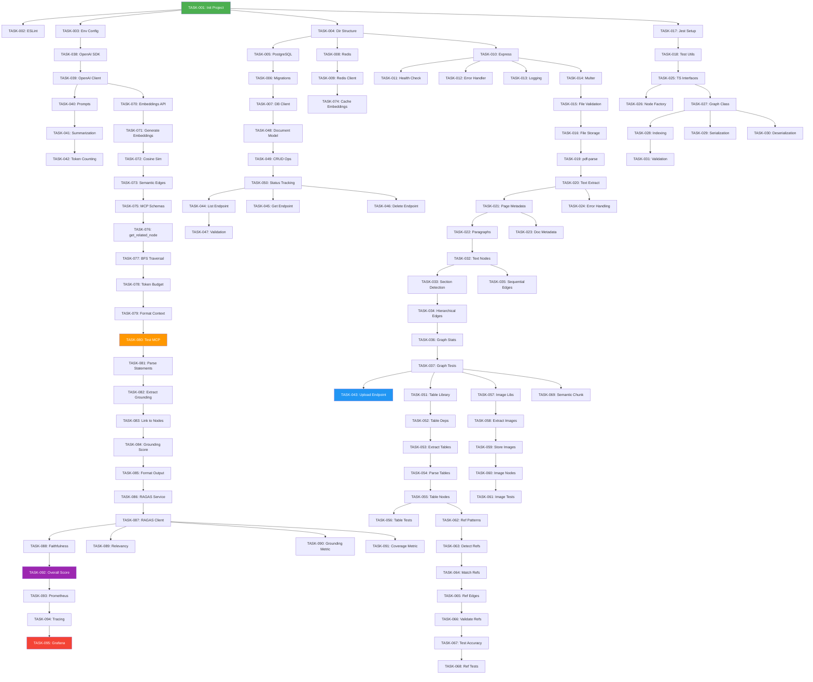

# Implementation Roadmap - PDF Summary AI

**Project**: Document-Aware PDF Summary System  
**Timeline**: 3 Phases (Foundation → Core → Advanced)  
**Approach**: Granular tasks, autonomous implementation via Grok/Cursor

---

## 📋 Table of Contents

1. [Overview](#overview)
2. [Phase 1: Foundation (Week 1)](#phase-1-foundation-week-1)
3. [Phase 2: Core Features (Week 2-3)](#phase-2-core-features-week-2-3)
4. [Phase 3: Advanced Features (Week 4+)](#phase-3-advanced-features-week-4)
5. [Task Dependency Graph](#task-dependency-graph)
6. [Testing Strategy](#testing-strategy)
7. [Deployment Plan](#deployment-plan)

---

## Overview

### Implementation Philosophy

1. **Granular Tasks**: Each task is atomic and independently testable
2. **No One-Shots**: Complex features broken into multiple subtasks
3. **Grok-Compatible**: Each task has clear acceptance criteria for AI agents
4. **Test-Driven**: Every task includes validation steps and regression tests
5. **Incremental**: Each phase builds on previous phase

### Task Structure

```
Task ID: TASK-XXX
├── Title: Clear, actionable task name
├── Description: What needs to be implemented
├── Acceptance Criteria: Must-pass conditions (testable)
├── Implementation Steps: Step-by-step guide
├── Validation Steps: How to verify correctness
├── Regression Tests: Test cases to prevent breakage
├── Dependencies: Which tasks must complete first
└── Estimated Time: Hours for implementation
```

---

## Phase 1: Foundation (Week 1)

**Goal**: Set up project infrastructure and basic API endpoints  
**Tasks**: 18 tasks  
**Duration**: 5-7 days

### Milestones

1. ✅ Project setup complete
2. ✅ Basic Express API running
3. ✅ Database connected
4. ✅ File upload working
5. ✅ Health checks passing

### Task Groups

#### 1.1 Project Setup (4 tasks)
- TASK-001: Initialize TypeScript Node.js project
- TASK-002: Configure ESLint + Prettier
- TASK-003: Set up environment configuration
- TASK-004: Create project directory structure

#### 1.2 Database Setup (3 tasks)
- TASK-005: Set up PostgreSQL with Docker
- TASK-006: Create database schema migrations
- TASK-007: Implement database client wrapper

#### 1.3 Cache Setup (2 tasks)
- TASK-008: Set up Redis with Docker
- TASK-009: Implement Redis client wrapper

#### 1.4 API Foundation (4 tasks)
- TASK-010: Create Express server with middleware
- TASK-011: Implement health check endpoint
- TASK-012: Set up error handling middleware
- TASK-013: Implement request logging

#### 1.5 File Upload (3 tasks)
- TASK-014: Configure Multer for file uploads
- TASK-015: Implement file validation (PDF, size)
- TASK-016: Create temporary file storage

#### 1.6 Testing Infrastructure (2 tasks)
- TASK-017: Set up Jest testing framework
- TASK-018: Create test utilities and fixtures

---

## Phase 2: Core Features (Week 2-3)

**Goal**: Implement PDF processing, graph building, and basic summarization  
**Tasks**: 32 tasks  
**Duration**: 10-14 days

### Milestones

1. ✅ PDF parsing working
2. ✅ Graph structure created
3. ✅ OpenAI integration complete
4. ✅ Basic summary generation
5. ✅ API endpoints functional

### Task Groups

#### 2.1 PDF Parser (6 tasks)
- TASK-019: Install and configure pdf-parse
- TASK-020: Implement basic text extraction
- TASK-021: Extract text with page metadata
- TASK-022: Implement paragraph detection
- TASK-023: Extract document metadata (title, author)
- TASK-024: Add error handling for corrupted PDFs

#### 2.2 Graph Data Structures (7 tasks)
- TASK-025: Define TypeScript interfaces (Node, Edge, Graph)
- TASK-026: Implement Node factory
- TASK-027: Implement Graph class with adjacency list
- TASK-028: Add graph indexing (by type, by page)
- TASK-029: Implement graph serialization
- TASK-030: Implement graph deserialization
- TASK-031: Create graph validation logic

#### 2.3 Graph Builder (6 tasks)
- TASK-032: Implement text node creation
- TASK-033: Implement section detection (headings)
- TASK-034: Create hierarchical edges (section → paragraph)
- TASK-035: Create sequential edges (paragraph flow)
- TASK-036: Implement graph statistics calculation
- TASK-037: Add graph builder unit tests

#### 2.4 OpenAI Integration (5 tasks)
- TASK-038: Install and configure OpenAI SDK
- TASK-039: Implement OpenAI client wrapper
- TASK-040: Create prompt template system
- TASK-041: Implement basic summarization
- TASK-042: Add token counting and cost estimation

#### 2.5 API Endpoints (5 tasks)
- TASK-043: Implement POST /api/upload endpoint
- TASK-044: Implement GET /api/documents endpoint
- TASK-045: Implement GET /api/documents/:id endpoint
- TASK-046: Implement DELETE /api/documents/:id endpoint
- TASK-047: Add API input validation (Zod)

#### 2.6 Document Management (3 tasks)
- TASK-048: Create Document database model
- TASK-049: Implement document CRUD operations
- TASK-050: Add document status tracking

---

## Phase 3: Advanced Features (Week 4+)

**Goal**: Add advanced features (tables, MCP, evaluation, observability)  
**Tasks**: 45 tasks  
**Duration**: 15-20 days

### Milestones

1. ✅ Table detection working
2. ✅ Reference edges implemented
3. ✅ MCP pattern functional
4. ✅ Evaluation system running
5. ✅ Observability dashboards live

### Task Groups

#### 3.1 Table Detection (6 tasks)
- TASK-051: Research and choose table detection library
- TASK-052: Install table detection dependencies
- TASK-053: Implement basic table extraction
- TASK-054: Parse table data into structured format
- TASK-055: Create table nodes in graph
- TASK-056: Add table detection tests

#### 3.2 Image Extraction (5 tasks)
- TASK-057: Install image extraction libraries
- TASK-058: Extract images from PDF
- TASK-059: Save images to storage (S3/local)
- TASK-060: Create image nodes in graph
- TASK-061: Add image extraction tests

#### 3.3 Reference Detection (7 tasks)
- TASK-062: Define reference patterns (regex)
- TASK-063: Implement reference text detection
- TASK-064: Match references to target nodes
- TASK-065: Create reference edges
- TASK-066: Add reference validation
- TASK-067: Test reference detection accuracy
- TASK-068: Add reference detection tests

#### 3.4 Semantic Processing (6 tasks)
- TASK-069: Implement semantic chunking
- TASK-070: Integrate OpenAI embeddings API
- TASK-071: Generate embeddings for text nodes
- TASK-072: Implement cosine similarity calculation
- TASK-073: Create semantic edges
- TASK-074: Add embeddings caching (Redis)

#### 3.5 MCP Context Retrieval (6 tasks)
- TASK-075: Define MCP tool schemas
- TASK-076: Implement get_related_node tool
- TASK-077: Implement neighborhood traversal (BFS)
- TASK-078: Add token budget management
- TASK-079: Create context formatting
- TASK-080: Test MCP retrieval with OpenAI

#### 3.6 Grounding System (5 tasks)
- TASK-081: Parse LLM output for statements
- TASK-082: Extract grounding references from metadata
- TASK-083: Link statements to source nodes
- TASK-084: Calculate grounding score
- TASK-085: Format grounded summary output

#### 3.7 Evaluation System (7 tasks)
- TASK-086: Set up Python RAGAS service
- TASK-087: Implement RAGAS client (Node.js)
- TASK-088: Calculate faithfulness score
- TASK-089: Calculate answer relevancy score
- TASK-090: Implement custom grounding metric
- TASK-091: Implement custom coverage metric
- TASK-092: Calculate overall evaluation score

#### 3.8 Observability (3 tasks)
- TASK-093: Set up Prometheus metrics
- TASK-094: Implement OpenTelemetry tracing
- TASK-095: Configure Grafana dashboards

---

## Task Dependency Graph



---

## Testing Strategy

### Test Levels

1. **Unit Tests**: Each task's validation steps
2. **Integration Tests**: Multi-task feature tests
3. **End-to-End Tests**: Full pipeline tests
4. **Regression Tests**: Prevent previous bugs

### Test Coverage Goals

- Unit Tests: 80%+
- Integration Tests: Key workflows
- E2E Tests: Happy path + error cases

### Continuous Testing

- Run tests on every commit
- Automated regression suite
- Performance benchmarks

---

## Deployment Plan

### Environments

1. **Local Development**: Docker Compose
2. **Staging**: Pre-production testing
3. **Production**: Full deployment

### Deployment Steps

1. Build Docker images
2. Run database migrations
3. Deploy backend services
4. Deploy frontend
5. Configure monitoring
6. Run smoke tests

---

## Success Metrics

### Phase 1 Success
- ✅ All 18 tasks complete
- ✅ Health checks passing
- ✅ File upload working
- ✅ Tests passing (>80% coverage)

### Phase 2 Success
- ✅ All 32 tasks complete
- ✅ PDF parsing functional
- ✅ Graph building working
- ✅ Basic summaries generated
- ✅ API endpoints operational

### Phase 3 Success
- ✅ All 45 tasks complete
- ✅ Advanced features working
- ✅ Evaluation scores >0.7
- ✅ Observability dashboards live
- ✅ Production-ready system

---

## Risk Management

### Technical Risks

| Risk | Mitigation |
|------|------------|
| PDF parsing failures | Robust error handling, fallbacks |
| OpenAI rate limits | Retry logic, exponential backoff |
| Graph performance | Redis caching, pagination |
| Evaluation accuracy | Multiple metrics, thresholds |

### Timeline Risks

| Risk | Mitigation |
|------|------------|
| Task underestimation | Buffer time, prioritization |
| Dependency delays | Parallel tracks, mocking |
| Integration issues | Early integration testing |

---

## Summary

**Total Tasks**: 95 granular tasks  
**Total Duration**: 30-40 days (4-6 weeks)  
**Approach**: Incremental, test-driven, AI-agent compatible  

**Next Steps**:
1. Review this roadmap
2. Read detailed task specifications (TASK-SPECIFICATIONS.md)
3. Execute tasks using Grok prompt (GROK-IMPLEMENTATION-PROMPT.md)
4. Track progress and adapt as needed
