# PDF Summary AI - Architecture Diagrams (Mermaid)

This document contains Mermaid diagrams for the document-aware PDF Summary AI system.

## Table of Contents

1. [System Context Diagram](#system-context-diagram)
2. [Container Architecture Diagram](#container-architecture-diagram)
3. [Processing Pipeline Flow](#processing-pipeline-flow)
4. [Google Gemini Quota Management Flow](#google-gemini-quota-management-flow-new) ⭐ **NEW**
5. [Knowledge Graph Structure](#knowledge-graph-structure)
6. [MCP Context Retrieval](#mcp-context-retrieval)
7. [Evaluation & Observability Flow](#evaluation--observability-flow)
8. [Data Flow Diagram](#data-flow-diagram)

---

## System Context Diagram

---

## Container Architecture Diagram

```mermaid
graph TB
    User[👤 User]
    
    subgraph Frontend[Frontend Container]
        ReactSPA[React SPA<br/>TypeScript + Vite<br/>- Upload UI<br/>- Summary View<br/>- Graph Visualization<br/>- Metrics Dashboard]
    end
    
    subgraph API[API Gateway Container]
        Express[Express + WebSocket<br/>- REST API<br/>- Real-time Updates<br/>- Authentication<br/>- Rate Limiting]
    end
    
    subgraph Processing[Document Processing Container]
        PDFParser[1️⃣ PDF Parser<br/>pdfplumber/pdf-parse]
        GraphBuilder[2️⃣ Graph Builder<br/>Nodes + Edges]
        Semantic[3️⃣ Semantic Processor<br/>Embeddings + Clustering]
        MCPRetriever[4️⃣ MCP Context Retriever<br/>Neighborhood Lookup]
        AIOrchestrator[5️⃣ AI Orchestrator<br/>Summarization + Grounding]
        
        PDFParser --> GraphBuilder
        GraphBuilder --> Semantic
        Semantic --> MCPRetriever
        MCPRetriever --> AIOrchestrator
    end
    
    subgraph Evaluation[Evaluation Container]
        RAGASService[RAGAS Metrics<br/>Python Service]
        CustomMetrics[Custom Metrics<br/>Grounding/Coverage]
        Tracing[OpenTelemetry<br/>Distributed Tracing]
        
        RAGASService --> CustomMetrics
        CustomMetrics --> Tracing
    end
    
    subgraph DataLayer[Data Layer]
        PostgreSQL[(PostgreSQL<br/>Documents<br/>History<br/>Evaluations)]
        Redis[(Redis<br/>Graph Cache<br/>Embeddings)]
        S3[(S3/GCS<br/>PDF Files<br/>Artifacts)]
    end
    
    subgraph Monitoring[Monitoring Stack]
        Prometheus[Prometheus<br/>Metrics Collection]
        Grafana[Grafana<br/>Visualization]
        
        Prometheus --> Grafana
    end
    
    User -->|HTTPS/WS| ReactSPA
    ReactSPA -->|API Calls| Express
    Express --> Processing
    Processing --> Evaluation
    Processing --> DataLayer
    Evaluation --> DataLayer
    Processing -->|Metrics| Prometheus
    Evaluation -->|Metrics| Prometheus
    User -->|View Dashboards| Grafana
    
    style Processing fill:#4CAF50,stroke:#2E7D32,stroke-width:3px,color:#fff
    style Evaluation fill:#9C27B0,stroke:#6A1B9A,stroke-width:2px,color:#fff
    style DataLayer fill:#607D8B,stroke:#37474F,stroke-width:2px,color:#fff
    style Monitoring fill:#FF9800,stroke:#E65100,stroke-width:2px,color:#fff
```

---

## Processing Pipeline Flow

---

## Google Gemini Quota Management Flow (NEW)

```mermaid
flowchart TD
    Start([LLM Request]) --> CheckReset{Daily Reset<br/>Needed?}
    
    CheckReset -->|Yes<br/>Past Midnight PT| ResetQuotas[🔄 Reset All Quotas<br/>tokens = 0<br/>requests = 0]
    CheckReset -->|No| DetectPurpose
    ResetQuotas --> DetectPurpose
    
    DetectPurpose[🎯 Detect Task Purpose<br/>Analyze: keywords + length]
    
    DetectPurpose --> Purpose{Purpose<br/>Type?}
    
    Purpose -->|bulk-processing| RecoBulk["📋 Recommend:<br/>1. flash-8b (4M TPM)<br/>2. 2.0-flash-exp (4M TPM)<br/>3. flash (1M TPM)"]
    Purpose -->|quick-summary| RecoQuick["⚡ Recommend:<br/>1. 2.0-flash-exp (FREE)<br/>2. flash (1M TPM)<br/>3. flash-8b (4M TPM)"]
    Purpose -->|standard-analysis| RecoStandard["📝 Recommend:<br/>1. flash (1M TPM)<br/>2. 2.0-flash-exp<br/>3. pro (32K TPM)"]
    Purpose -->|detailed-analysis| RecoDetailed["🔬 Recommend:<br/>1. pro (32K TPM)<br/>2. exp-1206 (32K TPM)<br/>3. flash (1M TPM)"]
    Purpose -->|vision-analysis| RecoVision["👁️ Recommend:<br/>1. flash (vision)<br/>2. pro (vision)<br/>3. 2.0-flash-exp"]
    Purpose -->|critical-task| RecoCritical["⚠️ Recommend:<br/>1. pro (best quality)<br/>2. exp-1206<br/>3. flash"]
    
    RecoBulk --> CheckQuota
    RecoQuick --> CheckQuota
    RecoStandard --> CheckQuota
    RecoDetailed --> CheckQuota
    RecoVision --> CheckQuota
    RecoCritical --> CheckQuota
    
    CheckQuota{Check Each<br/>Recommended<br/>Model}
    
    CheckQuota --> RPDCheck{RPD Limit<br/>Exceeded?}
    RPDCheck -->|Yes| NextModel[Try Next<br/>Recommended Model]
    RPDCheck -->|No| BudgetCheck
    
    BudgetCheck{Daily Budget<br/>Exceeded?}
    BudgetCheck -->|Yes| NextModel
    BudgetCheck -->|No| Selected[✅ Model Selected]
    
    NextModel --> MoreModels{More<br/>Recommended<br/>Models?}
    MoreModels -->|Yes| CheckQuota
    MoreModels -->|No| AnyAvailable{Any Model<br/>Available?}
    
    AnyAvailable -->|Yes| FallbackModel[⚠️ Use Fallback Model<br/>Any available model]
    AnyAvailable -->|No| QuotaError[❌ 429 Error<br/>All models exhausted<br/>Next reset: midnight PT]
    
    FallbackModel --> Selected
    
    Selected --> MakeLLMCall[🤖 Make LLM Call<br/>Selected Model]
    
    MakeLLMCall --> RecordUsage[📊 Record Usage<br/>tokens used<br/>requests count<br/>update totals]
    
    RecordUsage --> CheckThreshold{Budget<br/>Threshold?}
    
    CheckThreshold -->|≥ 90%| CriticalAlert[🚨 Critical Alert<br/>90% budget used]
    CheckThreshold -->|≥ 80%| WarnAlert[⚠️ Warning<br/>80% budget used]
    CheckThreshold -->|< 80%| LogUsage[📝 Log Usage Stats]
    
    CriticalAlert --> Return
    WarnAlert --> Return
    LogUsage --> Return
    
    Return([Return LLM Response<br/>+ Model Used<br/>+ Cost Tracking])
    
    style Start fill:#2196F3,stroke:#1565C0,stroke-width:2px,color:#fff
    style Selected fill:#4CAF50,stroke:#2E7D32,stroke-width:2px,color:#fff
    style QuotaError fill:#F44336,stroke:#C62828,stroke-width:2px,color:#fff
    style CriticalAlert fill:#F44336,stroke:#C62828,stroke-width:2px,color:#fff
    style WarnAlert fill:#FF9800,stroke:#E65100,stroke-width:2px,color:#fff
    style Return fill:#4CAF50,stroke:#2E7D32,stroke-width:2px,color:#fff
```

**Key Features:**
- ✅ **Daily Reset**: Automatic at midnight Pacific Time
- ✅ **6 Task Purposes**: bulk, quick, standard, detailed, vision, critical
- ✅ **Intelligent Selection**: Prioritized model recommendations per purpose
- ✅ **Quota Awareness**: Checks RPD limits and daily budget before selection
- ✅ **Smart Fallback**: Tries all recommended models, then any available
- ✅ **Cost Tracking**: Records usage, monitors thresholds (80%, 90%)
- ✅ **Error Handling**: 429 error with next reset time when all exhausted

---

## Knowledge Graph Structure

**Edge Types:**
- **Solid arrows** (→): Reference edges (explicit mentions)
- **Dashed arrows** (-.->): Hierarchical edges (parent-child)
- **Wavy lines** (~~~): Semantic edges (topic similarity)

---

## MCP Context Retrieval

```mermaid
sequenceDiagram
    participant LLM as 🤖 LLM<br/>(GPT-4o)
    participant Orchestrator as 🎭 AI Orchestrator
    participant MCP as 🛠️ MCP Retriever
    participant Graph as 📊 Document Graph
    
    Note over LLM,Graph: User Request: "Summarize financial performance"
    
    Orchestrator->>LLM: Send prompt with system instructions<br/>Tools: [get_related_node, get_table]
    
    LLM->>LLM: Generate initial response<br/>Detect reference to "Table 1"
    
    LLM->>Orchestrator: Function call: get_related_node(nodeId="table_1", depth=1)
    
    Orchestrator->>MCP: Execute tool call
    
    MCP->>Graph: Query graph for node "table_1"
    Graph-->>MCP: Return table node
    
    MCP->>Graph: Get neighbors (depth=1)<br/>Follow edges
    Graph-->>MCP: Return: [text_2, section_1]
    
    MCP-->>Orchestrator: MCPContext {<br/>  node: Table1,<br/>  neighbors: [text_2, section_1],<br/>  totalTokens: 512<br/>}
    
    Orchestrator->>LLM: Inject context into conversation<br/>"Here is Table 1 and related context..."
    
    LLM->>LLM: Generate summary using table data<br/>Add grounding reference
    
    LLM-->>Orchestrator: "Revenue grew 25% (Q1: $100M → Q4: $125M)<br/>[Node: table_1, Page 2]"
    
    Orchestrator->>Orchestrator: Post-process:<br/>- Validate grounding<br/>- Format output<br/>- Record metadata
    
    Orchestrator-->>LLM: Final summary with grounding
    
    Note over LLM,Graph: Key Innovation: LLM can "look up" referenced content<br/>just like a human flipping pages
```

---

## Evaluation & Observability Flow

```mermaid
flowchart TD
    Summary[📄 Generated Summary] --> EvalEngine[🎯 Evaluation Engine]
    
    EvalEngine --> RAGAS{Enable RAGAS?}
    RAGAS -->|Yes| RAGASMetrics[📊 RAGAS Metrics<br/>- Faithfulness<br/>- Answer Relevancy<br/>- Context Recall<br/>- Context Precision]
    RAGAS -->|No| CustomMetrics
    
    RAGASMetrics --> CustomMetrics[📏 Custom Metrics<br/>- Grounding Score<br/>- Coverage Score<br/>- Graph Utilization<br/>- Table/Image Accuracy]
    
    CustomMetrics --> Benchmark{Ground Truth<br/>Available?}
    Benchmark -->|Yes| BenchmarkMetrics[🎖️ Benchmark<br/>- ROUGE-L<br/>- BLEU<br/>- Semantic Similarity]
    Benchmark -->|No| CalcOverall
    
    BenchmarkMetrics --> CalcOverall[🧮 Calculate Overall Score<br/>Weighted Average]
    
    CalcOverall --> StoreScores[(💾 Store in PostgreSQL<br/>evaluation_results table)]
    
    CalcOverall --> PrometheusMetrics[📈 Send to Prometheus<br/>- summary_evaluation_score<br/>- grounding_score<br/>- faithfulness_score]
    
    PrometheusMetrics --> GrafanaDash[📊 Grafana Dashboards<br/>- Score trends<br/>- Performance charts<br/>- Alerting rules]
    
    CalcOverall --> Alert{Score < 0.7?}
    Alert -->|Yes| SendAlert[🚨 Trigger Alert<br/>Notify team]
    Alert -->|No| Complete
    
    SendAlert --> Complete[✅ Complete]
    
    subgraph Observability[Observability Stack]
        Tracing[🔍 OpenTelemetry Tracing<br/>- Span: Parse → Graph → Summary<br/>- Attributes: doc_id, nodes, edges]
        Logging[📝 Structured Logging<br/>- Winston/Pino<br/>- Correlation IDs<br/>- JSON format]
        
        Tracing --> Jaeger[📊 Jaeger UI<br/>Trace Visualization]
        Logging --> ELK[📊 ELK Stack<br/>Log Analysis]
    end
    
    Summary --> Tracing
    Summary --> Logging
    
    style EvalEngine fill:#9C27B0,stroke:#6A1B9A,stroke-width:2px,color:#fff
    style RAGASMetrics fill:#4CAF50,stroke:#2E7D32,stroke-width:2px,color:#fff
    style CustomMetrics fill:#2196F3,stroke:#1565C0,stroke-width:2px,color:#fff
    style SendAlert fill:#F44336,stroke:#C62828,stroke-width:2px,color:#fff
    style Observability fill:#FF9800,stroke:#E65100,stroke-width:2px,color:#fff
```

---

## Data Flow Diagram

```mermaid
flowchart LR
    subgraph Input[📥 Input Layer]
        UserUpload[👤 User Uploads<br/>50MB PDF]
    end
    
    subgraph Storage[💾 Storage Layer]
        S3[S3/GCS Bucket<br/>Raw PDFs]
        Redis[Redis Cache<br/>Graphs + Embeddings]
        PostgreSQL[PostgreSQL DB<br/>Metadata + Results]
    end
    
    subgraph Processing[⚙️ Processing Layer]
        Parse[PDF Parser<br/>Text + Tables + Images]
        Graph[Graph Builder<br/>Nodes + Edges]
        Embed[Embedding Generator<br/>OpenAI API]
        Cluster[Cluster Analyzer<br/>K-means]
    end
    
    subgraph AI[🤖 AI Layer]
        MCP[MCP Retriever<br/>Context Window]
        LLM[LLM Orchestrator<br/>GPT-4o / Gemini]
        PostProc[Post-Processor<br/>Grounding]
    end
    
    subgraph Evaluation[📊 Evaluation Layer]
        RAGAS[RAGAS Service<br/>Python]
        Custom[Custom Metrics<br/>Node.js]
    end
    
    subgraph Output[📤 Output Layer]
        WebSocket[WebSocket<br/>Real-time Updates]
        API[REST API<br/>Summary Results]
        Dashboard[Grafana<br/>Metrics Dashboard]
    end
    
    UserUpload --> S3
    S3 --> Parse
    Parse --> Graph
    Graph --> Embed
    Embed --> Cluster
    Cluster --> Redis
    
    Redis --> MCP
    MCP --> LLM
    LLM --> PostProc
    
    PostProc --> RAGAS
    PostProc --> Custom
    
    RAGAS --> PostgreSQL
    Custom --> PostgreSQL
    
    PostgreSQL --> WebSocket
    PostgreSQL --> API
    PostgreSQL --> Dashboard
    
    WebSocket --> UserUpload
    API --> UserUpload
    
    style Processing fill:#4CAF50,stroke:#2E7D32,stroke-width:2px,color:#fff
    style AI fill:#FF9800,stroke:#E65100,stroke-width:2px,color:#fff
    style Evaluation fill:#9C27B0,stroke:#6A1B9A,stroke-width:2px,color:#fff
    style Output fill:#2196F3,stroke:#1565C0,stroke-width:2px,color:#fff
```

---

## Component Interaction Sequence

```mermaid
sequenceDiagram
    participant U as 👤 User
    participant FE as 🖥️ Frontend<br/>(React)
    participant API as 🌐 API Gateway
    participant PP as ⚙️ Processing<br/>Pipeline
    participant Graph as 📊 Graph<br/>Builder
    participant MCP as 🛠️ MCP<br/>Retriever
    participant LLM as 🤖 OpenAI<br/>GPT-4o
    participant Eval as 📊 Evaluation<br/>Engine
    participant DB as 💾 Database
    
    U->>FE: Upload PDF (50MB)
    FE->>API: POST /api/upload<br/>multipart/form-data
    API->>DB: Create document record<br/>status: pending
    API-->>FE: Return document_id
    
    FE->>API: WebSocket connect<br/>/ws/progress/{document_id}
    
    API->>PP: Start async processing
    activate PP
    
    PP->>Graph: Parse PDF → Build Graph
    Graph->>Graph: Extract text, tables, images<br/>Create nodes + edges
    Graph-->>PP: DocumentGraph
    
    PP->>API: Progress: 40%<br/>Stage: GRAPH_BUILD
    API-->>FE: WebSocket: {"progress": 40, "stage": "GRAPH_BUILD"}
    
    PP->>PP: Generate embeddings<br/>Cluster analysis
    PP->>API: Progress: 60%<br/>Stage: EMBEDDING
    API-->>FE: WebSocket: {"progress": 60}
    
    PP->>MCP: Setup context retrieval
    MCP->>MCP: Index graph for lookup
    
    PP->>LLM: Summarization request<br/>Tools: [get_related_node]
    activate LLM
    
    LLM->>MCP: get_related_node("table_1")
    MCP-->>LLM: Return table + neighbors
    
    LLM->>MCP: get_related_node("text_5")
    MCP-->>LLM: Return text + context
    
    LLM-->>PP: Summary with grounding
    deactivate LLM
    
    PP->>API: Progress: 80%<br/>Stage: SUMMARIZATION
    API-->>FE: WebSocket: {"progress": 80}
    
    PP->>Eval: Evaluate summary
    activate Eval
    Eval->>Eval: RAGAS metrics<br/>Custom metrics
    Eval-->>PP: EvaluationScores
    deactivate Eval
    
    PP->>DB: Store summary + scores<br/>status: completed
    PP->>API: Progress: 100%<br/>Stage: COMPLETE
    
    deactivate PP
    
    API-->>FE: WebSocket: {"progress": 100, "summary": "...", "scores": {...}}
    FE-->>U: Display summary<br/>with grounding references
    
    U->>FE: View metrics
    FE->>API: GET /api/documents/{id}/metrics
    API->>DB: Query evaluation scores
    DB-->>API: Return scores
    API-->>FE: JSON response
    FE-->>U: Display evaluation dashboard
```

---

## Graph Node Relationships

---

## Deployment Architecture

---

## Metrics Collection Flow

---

## Summary

These Mermaid diagrams provide visual representations of:

1. **System Context**: High-level view of system boundaries and external dependencies
2. **Container Architecture**: Detailed container-level design with all services
3. **Processing Pipeline**: Step-by-step flow from PDF upload to summary generation
4. **Knowledge Graph**: Example graph structure showing nodes and edge types
5. **MCP Context Retrieval**: Sequence diagram showing how LLM retrieves related content
6. **Evaluation Flow**: Comprehensive evaluation and observability pipeline
7. **Data Flow**: How data moves through the system
8. **Component Interaction**: Detailed sequence diagram of user request handling
9. **Graph Relationships**: Entity-relationship diagram of graph data model
10. **Deployment**: Docker-based deployment architecture
11. **Metrics Collection**: How metrics are collected, stored, and visualized

All diagrams use color coding:
- 🟢 **Green**: Core processing components
- 🔵 **Blue**: User-facing and input/output
- 🟠 **Orange**: AI/LLM and external services
- 🟣 **Purple**: Evaluation and quality assurance
- 🔴 **Red**: Alerts and critical paths
- ⚫ **Gray**: Data storage and infrastructure

These can be rendered in any Markdown viewer that supports Mermaid (GitHub, GitLab, VS Code with Mermaid extension, etc.).
