# Automatic Summary Evaluation & Proof System

**How the system automatically validates and proves summary quality**

---

## 🎯 Overview

The architecture includes a **continuous, automatic evaluation phase** that runs after every summary generation to **mathematically prove** the quality and accuracy of the generated summary.

---

## 🔄 Automatic Evaluation Pipeline

### Flow: Summary Generation → Automatic Evaluation → Proof Metrics

```mermaid
flowchart TD
    Summary[📄 Generated Summary] --> EvalEngine{Evaluation Engine}
    
    EvalEngine --> RAGAS[🤖 RAGAS Metrics<br/>LLM-based validation]
    EvalEngine --> Custom[📊 Custom Metrics<br/>Programmatic validation]
    EvalEngine --> Benchmark[🎖️ Benchmark<br/>Ground truth comparison]
    
    RAGAS --> Faithfulness[Faithfulness: 0.92<br/>Does summary match source?]
    RAGAS --> Relevancy[Answer Relevancy: 0.88<br/>Is summary relevant?]
    RAGAS --> Recall[Context Recall: 0.85<br/>Covers important info?]
    RAGAS --> Precision[Context Precision: 0.90<br/>Avoids irrelevant info?]
    
    Custom --> Grounding[Grounding Score: 0.95<br/>% statements with refs]
    Custom --> Coverage[Coverage Score: 0.78<br/>% important nodes used]
    Custom --> GraphUtil[Graph Utilization: 0.42<br/>Edges traversed]
    Custom --> TableAcc[Table Accuracy: 1.0<br/>Correct table refs]
    
    Faithfulness --> Overall[✅ Overall Score: 0.87<br/>Weighted average]
    Relevancy --> Overall
    Recall --> Overall
    Precision --> Overall
    Grounding --> Overall
    Coverage --> Overall
    
    Overall --> AutoDecision{Score >= 0.7?}
    
    AutoDecision -->|Yes| Approved[✅ APPROVED<br/>Summary is valid]
    AutoDecision -->|No| Alert[🚨 ALERT<br/>Quality issue detected]
    
    Approved --> Store[(💾 Store with<br/>proof metrics)]
    Alert --> Review[👤 Human Review<br/>Required]
    
    Store --> UserDisplay[📱 Display to User<br/>+ Quality Badge]
    
    style EvalEngine fill:#9C27B0,stroke:#6A1B9A,stroke-width:3px,color:#fff
    style Overall fill:#4CAF50,stroke:#2E7D32,stroke-width:2px,color:#fff
    style Approved fill:#4CAF50,stroke:#2E7D32,stroke-width:2px,color:#fff
    style Alert fill:#F44336,stroke:#C62828,stroke-width:2px,color:#fff
```



---

## 📊 Evaluation Metrics (Automatic Proof System)

### 1. RAGAS Metrics (LLM-based validation)

#### **Faithfulness Score** (0-1)
**Proves**: Summary statements are factually grounded in source document

```typescript
// Automatic check
async evaluateFaithfulness(summary: string, contexts: string[]): Promise<number> {
  // Extract claims from summary
  const claims = this.extractClaims(summary);
  
  // For each claim, verify against source contexts using LLM
  const verifiedClaims = await Promise.all(
    claims.map(claim => this.llm.verify({
      claim,
      contexts,
      task: "Does the context support this claim? Yes/No"
    }))
  );
  
  const supportedClaims = verifiedClaims.filter(v => v.supported).length;
  return supportedClaims / claims.length;
}

// Example result
{
  faithfulness: 0.92,  // 92% of claims verified against source
  proof: {
    totalClaims: 12,
    supportedClaims: 11,
    unsupportedClaims: 1,
    unsupportedExamples: ["Revenue grew 30%"] // Actually 25% in source
  }
}
```

#### **Answer Relevancy Score** (0-1)
**Proves**: Summary is relevant to the document topic

```typescript
async evaluateAnswerRelevancy(summary: string, question: string): Promise<number> {
  // Generate ideal questions from summary
  const generatedQuestions = await this.llm.generateQuestions(summary);
  
  // Calculate similarity with actual question
  const similarities = generatedQuestions.map(q => 
    this.cosineSimilarity(
      await this.embed(q),
      await this.embed(question)
    )
  );
  
  return similarities.reduce((a, b) => a + b) / similarities.length;
}

// Example result
{
  answerRelevancy: 0.88,  // 88% relevant to "Summarize this document"
  proof: {
    originalQuestion: "Summarize this document",
    generatedQuestions: [
      "What are the key financial results?",
      "What market trends are discussed?",
      "What are the strategic initiatives?"
    ],
    avgSimilarity: 0.88
  }
}
```

#### **Context Recall Score** (0-1)
**Proves**: Summary covers all important information from source

```typescript
async evaluateContextRecall(summary: string, groundTruth: string): Promise<number> {
  // Extract key facts from ground truth
  const groundTruthFacts = await this.llm.extractFacts(groundTruth);
  
  // Check how many are mentioned in summary
  const recalledFacts = await Promise.all(
    groundTruthFacts.map(fact => 
      this.llm.checkMentioned(fact, summary)
    )
  );
  
  const mentioned = recalledFacts.filter(r => r).length;
  return mentioned / groundTruthFacts.length;
}

// Example result
{
  contextRecall: 0.85,  // 85% of important facts covered
  proof: {
    totalFacts: 20,
    recalledFacts: 17,
    missedFacts: [
      "Q4 dividend increase",
      "New board member appointment",
      "Office expansion plans"
    ]
  }
}
```

#### **Context Precision Score** (0-1)
**Proves**: Summary doesn't include irrelevant information

```typescript
async evaluateContextPrecision(summary: string, contexts: string[]): Promise<number> {
  // Extract sentences from summary
  const sentences = this.extractSentences(summary);
  
  // Check if each sentence is supported by relevant context
  const relevantSentences = await Promise.all(
    sentences.map(async (sentence, idx) => {
      const contextSubset = contexts.slice(0, idx + 1);
      return await this.llm.isRelevant(sentence, contextSubset);
    })
  );
  
  const relevant = relevantSentences.filter(r => r).length;
  return relevant / sentences.length;
}

// Example result
{
  contextPrecision: 0.90,  // 90% of sentences are relevant
  proof: {
    totalSentences: 10,
    relevantSentences: 9,
    irrelevantSentences: [
      "The company was founded in 1995." // Not relevant to Q4 report
    ]
  }
}
```

---

### 2. Custom Metrics (Programmatic validation)

#### **Grounding Score** (0-1)
**Proves**: Every statement is traceable to source nodes

```typescript
function calculateGroundingScore(summary: SummaryResponse): number {
  // Count sentences in summary
  const sentences = summary.summary.split(/[.!?]+/).filter(s => s.trim());
  
  // Count how many have grounding references
  const groundedSentences = summary.grounding.length;
  
  // Calculate percentage
  const score = groundedSentences / sentences.length;
  
  return {
    score,
    proof: {
      totalSentences: sentences.length,
      groundedSentences: groundedSentences,
      ungroundedSentences: sentences.length - groundedSentences,
      examples: summary.grounding.map(g => ({
        statement: g.statement,
        sourceNodes: g.sourceNodes,
        pages: g.pageNumbers,
        confidence: g.confidence
      }))
    }
  };
}

// Example result
{
  groundingScore: 0.95,  // 95% of statements have source references
  proof: {
    totalSentences: 20,
    groundedSentences: 19,
    ungroundedSentences: 1,
    examples: [
      {
        statement: "Revenue grew 25% in Q4.",
        sourceNodes: ["table_1", "text_5"],
        pages: [2, 3],
        confidence: 0.98
      },
      {
        statement: "Market share increased to 15%.",
        sourceNodes: ["table_3", "image_1"],
        pages: [5, 6],
        confidence: 0.92
      }
    ]
  }
}
```

#### **Coverage Score** (0-1)
**Proves**: Summary covers important document sections

```typescript
function calculateCoverageScore(
  summary: SummaryResponse,
  graph: DocumentGraph
): number {
  // Identify important nodes
  const importantNodes = identifyImportantNodes(graph);
  // - All headings
  // - All tables/images
  // - High-degree nodes (many connections)
  // - Nodes with keywords
  
  // Find which important nodes were used in summary
  const usedNodes = new Set(summary.grounding.flatMap(g => g.sourceNodes));
  const usedImportantNodes = [...usedNodes].filter(id => 
    importantNodes.has(id)
  );
  
  // Calculate coverage
  const score = usedImportantNodes.length / importantNodes.size;
  
  return {
    score,
    proof: {
      totalImportantNodes: importantNodes.size,
      usedImportantNodes: usedImportantNodes.length,
      unusedImportantNodes: importantNodes.size - usedImportantNodes.length,
      usedNodes: usedImportantNodes.map(id => {
        const node = graph.nodes.get(id);
        return {
          nodeId: id,
          type: node.type,
          page: node.metadata.page,
          preview: node.content.substring(0, 100)
        };
      }),
      missedNodes: [...importantNodes].filter(id => !usedNodes.has(id)).map(id => {
        const node = graph.nodes.get(id);
        return {
          nodeId: id,
          type: node.type,
          page: node.metadata.page,
          reason: "Not referenced in summary"
        };
      })
    }
  };
}

// Example result
{
  coverageScore: 0.78,  // 78% of important nodes used
  proof: {
    totalImportantNodes: 32,
    usedImportantNodes: 25,
    unusedImportantNodes: 7,
    usedNodes: [
      { nodeId: "section_1", type: "SECTION", page: 1, preview: "Executive Summary..." },
      { nodeId: "table_1", type: "TABLE", page: 2, preview: "Q1: $100M, Q2: $120M..." },
      // ... 23 more
    ],
    missedNodes: [
      { nodeId: "table_5", type: "TABLE", page: 8, reason: "Regional breakdown not summarized" },
      { nodeId: "section_7", type: "SECTION", page: 12, reason: "Appendix not included" },
      // ... 5 more
    ]
  }
}
```

#### **Graph Utilization Score** (0-1)
**Proves**: System effectively used graph structure

```typescript
function calculateGraphUtilization(
  summary: SummaryResponse,
  graph: DocumentGraph
): number {
  // Count total edges in graph
  const totalEdges = Array.from(graph.nodes.values())
    .reduce((sum, node) => sum + node.edges.length, 0);
  
  // Count how many edges were traversed during summarization
  const edgesTraversed = summary.metadata.edgesTraversed;
  
  // Calculate utilization
  const score = edgesTraversed / totalEdges;
  
  return {
    score,
    proof: {
      totalEdges: totalEdges,
      edgesTraversed: edgesTraversed,
      edgeTypes: {
        hierarchical: summary.metadata.edgesByType.hierarchical,
        reference: summary.metadata.edgesByType.reference,
        semantic: summary.metadata.edgesByType.semantic,
        sequential: summary.metadata.edgesByType.sequential
      },
      efficiency: `Traversed ${edgesTraversed} edges out of ${totalEdges} (${(score * 100).toFixed(1)}%)`
    }
  };
}

// Example result
{
  graphUtilization: 0.42,  // 42% of graph edges utilized
  proof: {
    totalEdges: 389,
    edgesTraversed: 163,
    edgeTypes: {
      hierarchical: 98,   // Section → Paragraph
      reference: 23,      // Text → Table ("see Table 1")
      semantic: 32,       // Similar paragraphs
      sequential: 10      // Paragraph flow
    },
    efficiency: "Traversed 163 edges out of 389 (42.0%)"
  }
}
```

#### **Table/Image Reference Accuracy** (0-1)
**Proves**: References to tables/images are correct

```typescript
function evaluateReferenceAccuracy(
  summary: SummaryResponse,
  graph: DocumentGraph
): number {
  // Find all references to tables/images in summary text
  const references = extractReferences(summary.summary);
  // e.g., "Table 1", "Figure 2", "see Table 3"
  
  // Verify each reference
  const verifiedRefs = references.map(ref => {
    // Find corresponding node in graph
    const targetNode = findNodeByReference(graph, ref);
    
    // Check if it's in grounding
    const isGrounded = summary.grounding.some(g => 
      g.sourceNodes.includes(targetNode?.id)
    );
    
    return { ref, found: !!targetNode, grounded: isGrounded };
  });
  
  const correct = verifiedRefs.filter(v => v.found && v.grounded).length;
  const score = references.length > 0 ? correct / references.length : 1.0;
  
  return {
    tableAccuracy: score,
    imageAccuracy: score,  // Same logic for images
    proof: {
      totalReferences: references.length,
      correctReferences: correct,
      incorrectReferences: references.length - correct,
      details: verifiedRefs.map(v => ({
        reference: v.ref,
        found: v.found,
        grounded: v.grounded,
        status: v.found && v.grounded ? "✅ Valid" : "❌ Invalid"
      }))
    }
  };
}

// Example result
{
  tableReferenceAccuracy: 1.0,  // 100% of table references are correct
  imageReferenceAccuracy: 1.0,  // 100% of image references are correct
  proof: {
    totalReferences: 5,
    correctReferences: 5,
    incorrectReferences: 0,
    details: [
      { reference: "Table 1", found: true, grounded: true, status: "✅ Valid" },
      { reference: "Table 2", found: true, grounded: true, status: "✅ Valid" },
      { reference: "Figure 1", found: true, grounded: true, status: "✅ Valid" },
      { reference: "Table 3", found: true, grounded: true, status: "✅ Valid" },
      { reference: "Figure 2", found: true, grounded: true, status: "✅ Valid" }
    ]
  }
}
```

---

### 3. Benchmark Metrics (Optional - if ground truth available)

#### **ROUGE-L Score** (0-1)
**Proves**: Summary matches human-written reference

```typescript
async evaluateROUGE(summary: string, reference: string): Promise<number> {
  // Calculate longest common subsequence
  const lcs = calculateLCS(summary, reference);
  
  const precision = lcs.length / summary.split(' ').length;
  const recall = lcs.length / reference.split(' ').length;
  const fScore = 2 * (precision * recall) / (precision + recall);
  
  return {
    rougeL: fScore,
    proof: {
      lcsLength: lcs.length,
      summaryLength: summary.split(' ').length,
      referenceLength: reference.split(' ').length,
      precision,
      recall,
      fScore
    }
  };
}
```

#### **BLEU Score** (0-1)
**Proves**: N-gram overlap with reference

#### **Semantic Similarity** (0-1)
**Proves**: Meaning similarity (embedding distance)

```typescript
async evaluateSemanticSimilarity(
  summary: string,
  reference: string
): Promise<number> {
  const summaryEmbedding = await this.embed(summary);
  const referenceEmbedding = await this.embed(reference);
  
  const similarity = cosineSimilarity(summaryEmbedding, referenceEmbedding);
  
  return {
    semanticSimilarity: similarity,
    proof: {
      embeddingDimensions: summaryEmbedding.length,
      cosineSimilarity: similarity,
      interpretation: similarity > 0.8 ? "High similarity" : 
                      similarity > 0.6 ? "Moderate similarity" : 
                      "Low similarity"
    }
  };
}
```

---

## 🎯 Overall Evaluation Score (Weighted)

```typescript
function calculateOverallScore(scores: EvaluationScores): number {
  const weights = {
    faithfulness: 0.25,      // Most important - factual accuracy
    answerRelevancy: 0.15,
    contextRecall: 0.15,
    contextPrecision: 0.10,
    groundingScore: 0.20,    // Important - traceability
    coverageScore: 0.15
  };
  
  const weightedSum = 
    scores.ragas.faithfulness * weights.faithfulness +
    scores.ragas.answerRelevancy * weights.answerRelevancy +
    scores.ragas.contextRecall * weights.contextRecall +
    scores.ragas.contextPrecision * weights.contextPrecision +
    scores.custom.groundingScore * weights.groundingScore +
    scores.custom.coverageScore * weights.coverageScore;
  
  return {
    overallScore: weightedSum,
    grade: weightedSum >= 0.9 ? "A (Excellent)" :
           weightedSum >= 0.8 ? "B (Good)" :
           weightedSum >= 0.7 ? "C (Acceptable)" :
           weightedSum >= 0.6 ? "D (Needs Improvement)" :
           "F (Failed)",
    proof: {
      calculation: `
        Faithfulness (25%):     ${scores.ragas.faithfulness.toFixed(2)} × 0.25 = ${(scores.ragas.faithfulness * 0.25).toFixed(3)}
        Answer Relevancy (15%): ${scores.ragas.answerRelevancy.toFixed(2)} × 0.15 = ${(scores.ragas.answerRelevancy * 0.15).toFixed(3)}
        Context Recall (15%):   ${scores.ragas.contextRecall.toFixed(2)} × 0.15 = ${(scores.ragas.contextRecall * 0.15).toFixed(3)}
        Context Precision (10%): ${scores.ragas.contextPrecision.toFixed(2)} × 0.10 = ${(scores.ragas.contextPrecision * 0.10).toFixed(3)}
        Grounding Score (20%):  ${scores.custom.groundingScore.toFixed(2)} × 0.20 = ${(scores.custom.groundingScore * 0.20).toFixed(3)}
        Coverage Score (15%):   ${scores.custom.coverageScore.toFixed(2)} × 0.15 = ${(scores.custom.coverageScore * 0.15).toFixed(3)}
        ─────────────────────────────────────────────────
        Overall Score:          ${weightedSum.toFixed(3)}
      `,
      threshold: 0.7,
      status: weightedSum >= 0.7 ? "✅ PASSED" : "❌ FAILED"
    }
  };
}

// Example result
{
  overallScore: 0.87,
  grade: "B (Good)",
  status: "✅ PASSED",
  proof: {
    calculation: "...",
    threshold: 0.7,
    message: "Summary quality meets acceptance criteria"
  }
}
```

---

## 🚨 Automatic Decision & Alerting

```typescript
interface EvaluationDecision {
  approved: boolean;
  score: number;
  grade: string;
  issues: string[];
  actions: string[];
}

function makeDecision(scores: EvaluationScores): EvaluationDecision {
  const threshold = 0.7;
  const issues: string[] = [];
  const actions: string[] = [];
  
  // Check each metric against thresholds
  if (scores.ragas.faithfulness < 0.8) {
    issues.push(`Low faithfulness (${scores.ragas.faithfulness.toFixed(2)}) - possible hallucination`);
    actions.push("Verify claims against source document");
  }
  
  if (scores.custom.groundingScore < 0.8) {
    issues.push(`Low grounding (${scores.custom.groundingScore.toFixed(2)}) - missing source references`);
    actions.push("Add grounding references to ungrounded statements");
  }
  
  if (scores.custom.coverageScore < 0.7) {
    issues.push(`Low coverage (${scores.custom.coverageScore.toFixed(2)}) - important sections missed`);
    actions.push("Include missing important nodes in summary");
  }
  
  const approved = scores.overallScore >= threshold && issues.length === 0;
  
  return {
    approved,
    score: scores.overallScore,
    grade: getGrade(scores.overallScore),
    issues,
    actions,
    recommendation: approved ? 
      "✅ Summary approved for display to user" :
      "🚨 Summary requires improvement or human review"
  };
}

// Example result
{
  approved: true,
  score: 0.87,
  grade: "B (Good)",
  issues: [],
  actions: [],
  recommendation: "✅ Summary approved for display to user"
}

// Or if quality issues detected:
{
  approved: false,
  score: 0.64,
  grade: "D (Needs Improvement)",
  issues: [
    "Low faithfulness (0.75) - possible hallucination",
    "Low coverage (0.62) - important sections missed"
  ],
  actions: [
    "Verify claims against source document",
    "Include missing important nodes in summary"
  ],
  recommendation: "🚨 Summary requires improvement or human review"
}
```

---

## 📱 User Display with Quality Badge

```typescript
interface SummaryDisplayData {
  summary: string;
  qualityBadge: {
    score: number;
    grade: string;
    emoji: string;
    color: string;
    label: string;
  };
  proofMetrics: {
    faithfulness: number;
    grounding: number;
    coverage: number;
    overallScore: number;
  };
  grounding: GroundingReference[];
}

// Example: User sees
{
  summary: "Revenue grew 25% in Q4 2024...",
  qualityBadge: {
    score: 0.87,
    grade: "B",
    emoji: "✅",
    color: "green",
    label: "Verified Summary (87%)"
  },
  proofMetrics: {
    faithfulness: 0.92,
    grounding: 0.95,
    coverage: 0.78,
    overallScore: 0.87
  },
  grounding: [
    {
      statement: "Revenue grew 25% in Q4 2024",
      sourceNodes: ["table_1", "text_5"],
      pages: [2, 3],
      confidence: 0.98
    }
  ]
}
```

---

## 🔍 Real-World Example

### Input Document
"Q4 2024 Financial Report" (25 pages, 142 nodes, 389 edges)

### Generated Summary
```
The company achieved strong financial performance in Q4 2024. Revenue grew 25% 
year-over-year to $125M [Node: table_1, Page 2], driven by increased market share 
in the SaaS segment [Node: text_5, Page 3]. Operating expenses decreased by 10% 
[Node: table_2, Page 4], resulting in improved profit margins. The company 
expanded into three new markets [Node: section_3, Page 7] and launched two new 
products [Node: text_12, Page 8].
```

### Automatic Evaluation Results

```json
{
  "ragas": {
    "faithfulness": 0.92,
    "answerRelevancy": 0.88,
    "contextRecall": 0.85,
    "contextPrecision": 0.90
  },
  "custom": {
    "groundingScore": 0.95,
    "coverageScore": 0.78,
    "graphUtilization": 0.42,
    "tableReferenceAccuracy": 1.0,
    "imageReferenceAccuracy": 1.0
  },
  "overallScore": 0.87,
  "grade": "B (Good)",
  "decision": {
    "approved": true,
    "issues": [],
    "recommendation": "✅ Summary approved for display"
  }
}
```

### Proof Statement
```
✅ VERIFIED SUMMARY (Score: 0.87/1.0, Grade: B)

Proof Metrics:
✓ Faithfulness: 92% (11/12 claims verified against source)
✓ Grounding: 95% (19/20 statements have source references)
✓ Coverage: 78% (25/32 important nodes used)
✓ Table References: 100% (2/2 table references verified)
✓ Context Recall: 85% (17/20 key facts included)
✓ Context Precision: 90% (9/10 sentences relevant)

Graph Utilization: 42% (163/389 edges traversed)
Total Nodes Used: 25
Pages Referenced: 8

Status: ✅ APPROVED for user display
```

---

## 🎯 Summary

**Yes, the system automatically proves summary quality through:**

1. ✅ **RAGAS Metrics** - LLM-based validation of faithfulness, relevancy, recall, precision
2. ✅ **Custom Metrics** - Programmatic validation of grounding, coverage, graph utilization
3. ✅ **Benchmark Metrics** - Optional comparison with ground truth (ROUGE, BLEU, semantic)
4. ✅ **Overall Score** - Weighted combination with pass/fail threshold (0.7)
5. ✅ **Automatic Decision** - Approve or flag for review based on scores
6. ✅ **Quality Badge** - User sees verification status with the summary
7. ✅ **Detailed Proof** - Every metric includes proof/evidence of calculation

**The evaluation is:**
- ✅ Automatic (runs after every summary generation)
- ✅ Comprehensive (8+ metrics from multiple angles)
- ✅ Traceable (every score has proof/evidence)
- ✅ Actionable (flags specific issues for improvement)
- ✅ Observable (metrics exposed to Prometheus/Grafana)

**This is continuous quality assurance at the architecture level.**
