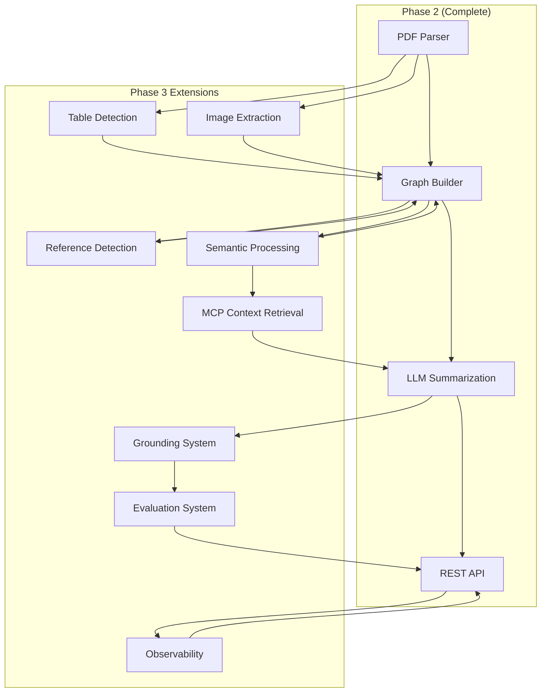

# PDF Summary AI - Phase 3 Continuation Prompt

**Continuing from Phase 2 Complete (TASK-050) → Phase 3: Advanced Features (TASK-051 onwards)**

---

## 🎯 Current Status

**Phase 1: Foundation - COMPLETED ✅**
- ✅ All 18 foundation tasks complete
- ✅ Express server running on port 4000
- ✅ PostgreSQL + Redis operational
- ✅ File upload system functional
- ✅ Jest testing framework ready
- ✅ Health checks passing (13/13 tests)

**Phase 2: Core Features - COMPLETED ✅**
- ✅ All 32 core feature tasks complete
- ✅ PDF parsing with text extraction and metadata
- ✅ Graph data structures (Node/Edge/Graph) implemented
- ✅ Graph builder with hierarchical and sequential relationships
- ✅ OpenAI integration with client wrapper and prompt templates
- ✅ Graph-aware summarization service with 6 summary types
- ✅ Token counting and cost estimation with analytics
- ✅ Complete REST API (upload, list, get, delete, summarize)
- ✅ Document management with CRUD operations and status tracking
- ✅ Comprehensive Zod validation schemas
- ✅ End-to-end PDF upload → graph → summary pipeline

**Phase 3: Advanced Features - STARTING NOW 🚀**
- **Goal**: Add advanced PDF processing (tables, images, references), semantic processing, MCP context retrieval, grounding system, evaluation metrics, and observability
- **Tasks**: 45 tasks (TASK-051 through TASK-095)
- **Duration**: 15-20 days
- **Milestones**: Tables → Images → References → Semantics → MCP → Grounding → Evaluation → Observability

---

## 📋 Phase 3 Task Overview

### 3.1 Table Detection (6 tasks: TASK-051 to TASK-056)
- TASK-051: Research and choose table detection library
- TASK-052: Install table detection dependencies
- TASK-053: Implement basic table extraction
- TASK-054: Parse table data into structured format
- TASK-055: Create table nodes in graph
- TASK-056: Add table detection tests

### 3.2 Image Extraction (5 tasks: TASK-057 to TASK-061)
- TASK-057: Install image extraction libraries
- TASK-058: Extract images from PDF
- TASK-059: Save images to storage (local/S3)
- TASK-060: Create image nodes in graph
- TASK-061: Add image extraction tests

### 3.3 Reference Detection (7 tasks: TASK-062 to TASK-068)
- TASK-062: Define reference patterns (regex)
- TASK-063: Implement reference text detection
- TASK-064: Match references to target nodes
- TASK-065: Create reference edges
- TASK-066: Add reference validation
- TASK-067: Test reference detection accuracy
- TASK-068: Add reference detection tests

### 3.4 Semantic Processing (6 tasks: TASK-069 to TASK-074)
- TASK-069: Implement semantic chunking
- TASK-070: Integrate OpenAI embeddings API
- TASK-071: Generate embeddings for text nodes
- TASK-072: Implement cosine similarity calculation
- TASK-073: Create semantic edges
- TASK-074: Add embeddings caching (Redis)

### 3.5 MCP Context Retrieval (6 tasks: TASK-075 to TASK-080)
- TASK-075: Define MCP tool schemas
- TASK-076: Implement get_related_node tool
- TASK-077: Implement neighborhood traversal (BFS)
- TASK-078: Add token budget management
- TASK-079: Create context formatting
- TASK-080: Test MCP retrieval with OpenAI

### 3.6 Grounding System (5 tasks: TASK-081 to TASK-085)
- TASK-081: Parse LLM output for statements
- TASK-082: Extract grounding references from metadata
- TASK-083: Link statements to source nodes
- TASK-084: Calculate grounding score
- TASK-085: Format grounded summary output

### 3.7 Evaluation System (7 tasks: TASK-086 to TASK-092)
- TASK-086: Set up Python RAGAS service
- TASK-087: Implement RAGAS client (Node.js)
- TASK-088: Calculate faithfulness score
- TASK-089: Calculate answer relevancy score
- TASK-090: Implement custom grounding metric
- TASK-091: Implement custom coverage metric
- TASK-092: Calculate overall evaluation score

### 3.8 Observability (3 tasks: TASK-093 to TASK-095)
- TASK-093: Set up Prometheus metrics
- TASK-094: Implement OpenTelemetry tracing
- TASK-095: Configure Grafana dashboards

---

## 🎯 Phase 3 Continuation Instructions

**Prerequisites (Already Completed from Phase 1 & 2)**

✅ Node.js project with TypeScript
✅ Docker containers running (PostgreSQL + Redis)
✅ Database schema and migrations
✅ Client wrappers for database and Redis
✅ Express server with middleware (CORS, compression, security)
✅ File upload system with Multer and validation
✅ Jest testing framework with TypeScript
✅ Health check endpoint (/api/health)
✅ Code quality tools (ESLint + Prettier)

✅ **PDF Parser Service** - Complete PDF parsing with text extraction, metadata, paragraph detection
✅ **Graph Data Structures** - Node/Edge/Graph interfaces, Graph class with adjacency list
✅ **Graph Builder** - Converts PDF to knowledge graph with hierarchical and sequential relationships
✅ **OpenAI Integration** - Client wrapper, prompt templates, summarization service, token management
✅ **API Layer** - Complete REST API with document management, validation, and error handling

**Current Project Structure**
```
pdf-summarize/
├── docker-compose.yml          # PostgreSQL + Redis services ✅
├── src/
│   ├── config/environment.ts   # Environment configuration ✅
│   ├── database/               # PostgreSQL + Redis clients ✅
│   ├── api/
│   │   ├── controllers/
│   │   │   └── document.controller.ts  # API endpoints ✅
│   │   ├── middleware/
│   │   │   └── upload.ts       # File upload middleware ✅
│   │   ├── routes/
│   │   │   └── documents.ts    # Document routes ✅
│   │   └── schemas.ts          # Zod validation schemas ✅
│   ├── models/
│   │   ├── graph.model.ts      # Graph data structures ✅
│   │   └── index.ts            # TypeScript interfaces ✅
│   ├── services/
│   │   ├── pdf-parser.service.ts        # PDF processing ✅
│   │   ├── graph/                       # Graph services ✅
│   │   │   ├── graph.ts                 # Graph class implementation
│   │   │   ├── graph-factory.ts         # Node/Edge factories
│   │   │   ├── graph-builder.ts         # PDF to graph conversion
│   │   │   └── index.ts                 # Exports
│   │   ├── llm/                         # LLM services ✅
│   │   │   ├── OpenAIProvider.ts        # OpenAI integration
│   │   │   ├── GoogleProvider.ts        # Google AI integration
│   │   │   ├── LLMProviderManager.ts    # Provider management
│   │   │   ├── prompt-templates.ts      # Prompt templates
│   │   │   ├── summarization.service.ts # Summarization service
│   │   │   ├── token-manager.ts         # Token & cost management
│   │   │   └── index.ts                 # Exports
│   │   ├── document.service.ts          # Document CRUD ✅
│   │   └── [NEW] Phase 3 services will be added here
│   ├── utils/                  # Logger, errors ✅
│   └── server.ts               # Express server ✅
├── tests/
│   ├── unit/                   # Unit tests ✅
│   ├── fixtures/               # Mock data ✅
│   └── utils/                  # Test helpers ✅
└── package.json                # Dependencies ✅
```

---

## 🚀 Continuation Strategy

**Start with TASK-051: Research and choose table detection library**

Follow sequential order within each task group:
1. Table Detection (TASK-051 → TASK-056)
2. Image Extraction (TASK-057 → TASK-061)
3. Reference Detection (TASK-062 → TASK-068)
4. Semantic Processing (TASK-069 → TASK-074)
5. MCP Context Retrieval (TASK-075 → TASK-080)
6. Grounding System (TASK-081 → TASK-085)
7. Evaluation System (TASK-086 → TASK-092)
8. Observability (TASK-093 → TASK-095)

**Test incrementally**: Run tests after each task completion

**Use existing patterns**: Follow established code structure from Phase 1 & 2

**Maintain type safety**: Continue using TypeScript interfaces

**Extend existing services**: Build upon the graph builder and document management systems

---

## 📚 Key Documentation References

**Required Reading for Phase 3:**
- [`docs/implementation/TASK-SPECIFICATIONS.md`](./docs/implementation/TASK-SPECIFICATIONS.md) - Detailed task specs (Phase 3 tasks to be added)
- [`docs/architecture/C4-ARCHITECTURE.md`](./docs/architecture/C4-ARCHITECTURE.md) - System design
- [`docs/llm/MULTI-LLM-QUICKSTART.md`](./docs/llm/MULTI-LLM-QUICKSTART.md) - LLM integration
- [`src/services/llm/README.md`](./src/services/llm/README.md) - LLM service patterns

**Integration Points:**
- Graph: Extend `GraphBuilder` from `src/services/graph/`
- LLM: Use `llmProviderManager` from `src/services/llm/`
- Document: Use `documentService` from `src/services/document.service.ts`
- Models: Extend interfaces in `src/models/graph.model.ts`
- Environment: Use `config` from `src/config/environment.ts`

---

## 🎯 Phase 3 Success Criteria

**After completing all Phase 3 tasks:**

✅ **Table Detection:**
- PDF tables extracted and parsed into structured data
- Table nodes created in knowledge graph
- Table data accessible via API
- Table extraction tests passing

✅ **Image Extraction:**
- Images extracted from PDF pages
- Images stored locally or in cloud storage
- Image nodes created in knowledge graph
- Image metadata and OCR support

✅ **Reference Detection:**
- Cross-references between document sections detected
- Reference edges created in graph
- Reference validation and accuracy testing
- Complex document navigation support

✅ **Semantic Processing:**
- Text nodes chunked semantically
- OpenAI embeddings generated for content
- Cosine similarity calculations for related content
- Semantic edges connecting related concepts
- Embeddings cached in Redis for performance

✅ **MCP Context Retrieval:**
- MCP tool schemas defined for LLM integration
- get_related_node tool implemented
- BFS traversal for graph neighborhood exploration
- Token budget management for context windows
- Context formatting optimized for LLM consumption

✅ **Grounding System:**
- LLM outputs parsed for factual statements
- Statements linked back to source document nodes
- Grounding scores calculated for reliability
- Grounded summary output with source attribution

✅ **Evaluation System:**
- Python RAGAS service for evaluation metrics
- Node.js client for RAGAS integration
- Faithfulness and relevancy scores calculated
- Custom grounding and coverage metrics
- Overall evaluation dashboard

✅ **Observability:**
- Prometheus metrics collection
- OpenTelemetry distributed tracing
- Grafana dashboards for system monitoring
- Performance metrics and alerting

✅ **Testing & Quality:**
- All new code tested (unit + integration)
- Test coverage maintained >80%
- ESLint + Prettier passing
- Performance benchmarks for new features
- End-to-end testing for advanced features

---

## 🔗 Integration Points Summary

**Graph Extensions:**
```typescript
import { GraphBuilder } from '../services/graph';
// Extend GraphBuilder to add table nodes, image nodes, reference edges, semantic edges
```

**LLM Extensions:**
```typescript
import { llmProviderManager } from '../services/llm';
// Use for embeddings generation, MCP context retrieval, evaluation
```

**Document Extensions:**
```typescript
import { documentService } from '../services/document.service';
// Extend document metadata to include table/image/reference information
```

**New Services to Create:**
- `table-detection.service.ts` - Table extraction and parsing
- `image-extraction.service.ts` - Image extraction and storage
- `reference-detection.service.ts` - Cross-reference analysis
- `semantic-processing.service.ts` - Embeddings and similarity
- `mcp-context.service.ts` - MCP tool implementation
- `grounding.service.ts` - Statement grounding and scoring
- `evaluation.service.ts` - RAGAS integration and metrics
- `observability.service.ts` - Metrics and tracing

---

## 🏃‍♂️ Next Steps Execution

**TASK-051: Research and choose table detection library**
1. Research table detection libraries (Camelot, Tabula, pdfplumber)
2. Evaluate based on accuracy, ease of use, Node.js compatibility
3. Choose primary library with fallback options
4. Document decision and implementation approach

**Continue through Phase 3 systematically...**

---

## 📊 Progress Tracking

**Phase 3 Progress**: 0/45 tasks complete
**Overall Progress**: 50/95 tasks complete (53%)

**Phase 3 Milestones:**
- [ ] Table detection working (6/45)
- [ ] Image extraction complete (11/45)
- [ ] Reference detection functional (18/45)
- [ ] Semantic processing implemented (24/45)
- [ ] MCP context retrieval working (30/45)
- [ ] Grounding system operational (35/45)
- [ ] Evaluation system running (42/45)
- [ ] Observability dashboards live (45/45)

---

## 🔧 Key Technical Considerations

### **Table Detection Challenges**
- PDF table formats vary widely (bordered, borderless, complex layouts)
- Need robust fallback strategies
- Performance impact on large documents
- Data type inference for table cells

### **Image Extraction Challenges**
- Multiple image formats in PDFs
- OCR integration for image content
- Storage strategy (local vs cloud)
- Image metadata extraction

### **Reference Detection Challenges**
- Complex reference patterns (figures, tables, sections, citations)
- Context-dependent reference resolution
- Ambiguity handling
- Performance for large documents

### **Semantic Processing Challenges**
- Embedding API rate limits and costs
- Similarity threshold tuning
- Redis caching strategy for embeddings
- Memory usage for large document sets

### **MCP Integration Challenges**
- Tool schema design for graph traversal
- Token budget optimization
- Context relevance filtering
- Real-time performance requirements

### **Evaluation System Challenges**
- RAGAS setup and integration
- Metric calculation accuracy
- Baseline establishment
- Continuous evaluation pipeline

---

## 🎯 Phase 3 Architecture Extensions

The Phase 3 architecture extends the existing system with:



---

## 💡 Implementation Priorities

### **High Priority (Must-Have for Demo)**
- Table detection and parsing
- Image extraction with OCR
- Reference detection for document navigation
- Basic semantic similarity
- MCP context retrieval demo

### **Medium Priority (Nice-to-Have)**
- Advanced embeddings caching
- Complex reference pattern matching
- Grounding score calculations
- Basic evaluation metrics

### **Low Priority (Future Enhancements)**
- Full RAGAS integration
- Advanced observability dashboards
- Distributed tracing
- Performance optimizations

---

## 🚀 Ready to begin Phase 3 implementation!

**Start with TASK-051 and proceed systematically through table detection, image extraction, reference detection, semantic processing, MCP integration, grounding, evaluation, and observability.**

**The core PDF → Graph → Summary pipeline is complete - Phase 3 will add advanced document understanding and evaluation capabilities! 🚀**

---

**Last Updated**: 2025-11-27
**Phase 3 Tasks**: 45 remaining (TASK-051 to TASK-095)
**Estimated Duration**: 15-20 days
**Ready for**: Advanced PDF processing features
