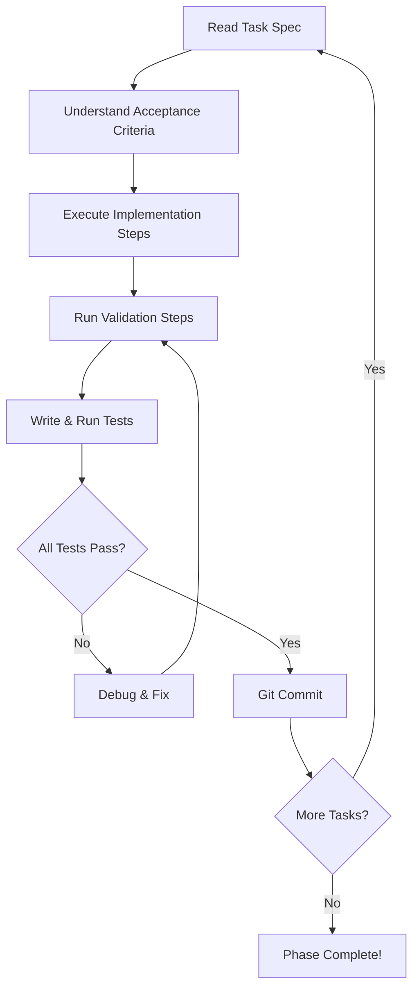

# Grok/Cursor Autonomous Implementation Prompt

**For AI Agent Mode in Cursor IDE with Grok Model**

---

## 🎯 Mission

You are an AI coding agent tasked with implementing a **Document-Aware PDF Summary AI System** using the knowledge graph approach. You will implement 95 granular tasks across 3 phases, following strict specifications with test-driven development.

---

## 📋 Your Capabilities

- **Write Code**: Create new files and modify existing ones
- **Run Commands**: Execute shell commands (npm, git, docker)
- **Test**: Run tests and verify results
- **Debug**: Fix errors and improve code quality
- **Commit**: Make atomic git commits after each task

---

## 🎓 Context & Architecture

### Project Overview

**Name**: PDF Summary AI  
**Type**: Document-aware system using Knowledge Graphs  
**Stack**: TypeScript + Node.js + Express + PostgreSQL + Redis + OpenAI

### Core Innovation

Traditional RAG systems treat PDFs as flat text. This system treats PDFs as **Knowledge Graphs**:
- **Nodes**: Sections, paragraphs, tables, images (with page numbers)
- **Edges**: Hierarchical, reference, semantic, sequential relationships
- **Intelligence**: AI can "look up" references like a human flipping pages

### Key Features

1. **Graph-Based Processing**: Parse PDF → Build Graph → Summarize with context
2. **MCP Pattern**: LLM requests context via tools (get_related_node)
3. **Grounding**: Every summary statement traceable to Node ID + Page
4. **Automatic Evaluation**: RAGAS + custom metrics validate quality
5. **Observability**: Prometheus + Grafana monitoring

---

## 📚 Documentation Available

You have access to these documentation files in `/home/user/webapp/`:

1. **README.md** - Project overview and navigation
2. **C4-ARCHITECTURE.md** - Complete architecture (4 levels, 1,586 lines)
3. **ARCHITECTURE-DIAGRAMS.md** - 11 Mermaid diagrams
4. **IMPLEMENTATION-GUIDE.md** - Step-by-step guide
5. **IMPLEMENTATION-ROADMAP.md** - 95 tasks organized in 3 phases
6. **TASK-SPECIFICATIONS.md** - Detailed specs for each task
7. **EVALUATION-PROOF.md** - Automatic quality validation system

**Read these files first to understand the system!**

---

## 🚀 Execution Instructions

### Phase 1: Foundation (Tasks 001-018)

**Goal**: Set up project infrastructure  
**Duration**: 5-7 days  
**Critical Path**: Setup → Database → API → Testing

**Start here**:

```bash
# Read the roadmap
cat IMPLEMENTATION-ROADMAP.md | grep "Phase 1"

# Read task specifications
cat TASK-SPECIFICATIONS.md | grep "TASK-001" -A 50
```

**Execution Pattern for Each Task**:

1. **Read Task Spec**:
   ```bash
   # Example: Read TASK-001
   cat TASK-SPECIFICATIONS.md | grep "TASK-001" -A 50
   ```

2. **Understand Acceptance Criteria**:
   - What must be true when done?
   - How will you verify success?

3. **Follow Implementation Steps**:
   - Execute each step sequentially
   - Don't skip steps
   - If a step fails, debug before continuing

4. **Run Validation Steps**:
   - Execute all validation commands
   - Verify expected outputs
   - Fix any issues

5. **Write Regression Tests**:
   - Create test file as specified
   - Run tests: `npm test`
   - Ensure all tests pass

6. **Commit**:
   ```bash
   git add .
   git commit -m "feat(TASK-XXX): [task title]

   - Implemented [feature]
   - Added tests
   - Validated: [validation summary]
   
   Acceptance Criteria:
   ✅ [criterion 1]
   ✅ [criterion 2]"
   ```

7. **Verify**:
   ```bash
   # Check commit
   git log -1
   
   # Run all tests
   npm test
   
   # Check build
   npm run build
   ```

---

### Task Execution Example: TASK-001

Let me show you how to execute a single task following the spec:

#### Step 1: Read the Spec

```yaml
TASK-001: Initialize TypeScript Node.js Project
Priority: High
Estimated Time: 0.5 hours
Dependencies: None

Acceptance Criteria:
- ✅ package.json exists with correct name and version
- ✅ tsconfig.json configured for Node.js + strict mode
- ✅ TypeScript compiles without errors
- ✅ src/ directory exists
- ✅ .gitignore configured for Node.js
```

#### Step 2: Execute Implementation Steps

```bash
# 1. Create project directory
cd /home/user/webapp
mkdir backend
cd backend

# 2. Initialize npm
npm init -y

# 3. Install TypeScript
npm install -D typescript @types/node

# 4. Create tsconfig.json
cat > tsconfig.json << 'EOF'
{
  "compilerOptions": {
    "target": "ES2020",
    "module": "commonjs",
    "lib": ["ES2020"],
    "outDir": "./dist",
    "rootDir": "./src",
    "strict": true,
    "esModuleInterop": true,
    "skipLibCheck": true,
    "forceConsistentCasingInFileNames": true,
    "resolveJsonModule": true
  },
  "include": ["src/**/*"],
  "exclude": ["node_modules", "dist"]
}
EOF

# 5. Create src/ directory
mkdir src

# 6. Update package.json scripts
npm install -D ts-node-dev
npm pkg set scripts.build="tsc"
npm pkg set scripts.start="node dist/server.js"
npm pkg set scripts.dev="ts-node-dev --respawn --transpile-only src/server.ts"

# 7. Create .gitignore
cat > .gitignore << 'EOF'
node_modules/
dist/
.env
*.log
EOF
```

#### Step 3: Run Validation Steps

```bash
# 1. Build TypeScript
npm run build
# ✅ Should compile without errors

# 2. Check dist/ exists
ls -la dist/
# ✅ Directory should exist (empty is ok)

# 3. Verify strict mode
cat tsconfig.json | grep strict
# ✅ Should show "strict": true
```

#### Step 4: Write Regression Tests

```bash
# Create test directory
mkdir -p tests

# Create basic test
cat > tests/setup.test.ts << 'EOF'
describe('Project Setup', () => {
  test('TypeScript compiles', () => {
    expect(true).toBe(true);
  });
});
EOF

# Install Jest
npm install -D jest @types/jest ts-jest

# Configure Jest
npx ts-jest config:init

# Run tests
npm test
```

#### Step 5: Commit

```bash
git add .
git commit -m "feat(TASK-001): Initialize TypeScript Node.js project

- Initialized npm project with package.json
- Configured TypeScript with strict mode
- Created src/ directory structure
- Added build and dev scripts
- Configured .gitignore for Node.js

Acceptance Criteria:
✅ package.json exists with scripts
✅ tsconfig.json configured with strict mode
✅ TypeScript compiles without errors
✅ src/ directory created
✅ .gitignore configured"

git push origin main
```

---

## 🔄 Continuous Execution Pattern

For each task, follow this loop:



---

## 📦 Phase-by-Phase Execution

### Phase 1: Foundation (Tasks 001-018)

```bash
# Step 1: Read phase overview
cat IMPLEMENTATION-ROADMAP.md | sed -n '/Phase 1: Foundation/,/Phase 2:/p'

# Step 2: Execute tasks sequentially
for task in {001..018}; do
  echo "=== Executing TASK-$task ==="
  
  # Read spec
  cat TASK-SPECIFICATIONS.md | grep "TASK-$task" -A 100 | head -150
  
  # Execute (you implement based on spec)
  # ... implementation steps ...
  
  # Validate
  npm test
  npm run build
  
  # Commit
  git add .
  git commit -m "feat(TASK-$task): [title]"
  git push origin main
  
  echo "✅ TASK-$task complete"
done
```

**Phase 1 Milestones**:
1. ✅ Project setup complete (TASK-001 to TASK-004)
2. ✅ Database setup complete (TASK-005 to TASK-009)
3. ✅ API foundation complete (TASK-010 to TASK-013)
4. ✅ File upload working (TASK-014 to TASK-016)
5. ✅ Testing infrastructure ready (TASK-017 to TASK-018)

### Phase 2: Core Features (Tasks 019-050)

```bash
# Step 1: Verify Phase 1 complete
npm test
npm run build
docker-compose ps  # All services should be "Up"

# Step 2: Read phase overview
cat IMPLEMENTATION-ROADMAP.md | sed -n '/Phase 2: Core Features/,/Phase 3:/p'

# Step 3: Execute tasks (same pattern as Phase 1)
for task in {019..050}; do
  # ... same execution pattern ...
done
```

**Phase 2 Milestones**:
1. ✅ PDF parsing working (TASK-019 to TASK-024)
2. ✅ Graph structure created (TASK-025 to TASK-031)
3. ✅ Graph builder functional (TASK-032 to TASK-037)
4. ✅ OpenAI integration complete (TASK-038 to TASK-042)
5. ✅ API endpoints operational (TASK-043 to TASK-050)

### Phase 3: Advanced Features (Tasks 051-095)

```bash
# Step 1: Verify Phase 2 complete
npm test
curl http://localhost:4000/api/health  # Should return 200

# Step 2: Execute advanced tasks
for task in {051..095}; do
  # ... same execution pattern ...
done
```

**Phase 3 Milestones**:
1. ✅ Table detection working (TASK-051 to TASK-056)
2. ✅ Image extraction complete (TASK-057 to TASK-061)
3. ✅ Reference edges implemented (TASK-062 to TASK-068)
4. ✅ Semantic processing functional (TASK-069 to TASK-074)
5. ✅ MCP pattern working (TASK-075 to TASK-080)
6. ✅ Grounding system operational (TASK-081 to TASK-085)
7. ✅ Evaluation system running (TASK-086 to TASK-092)
8. ✅ Observability live (TASK-093 to TASK-095)

---

## 🧪 Testing Guidelines

### Unit Tests (Every Task)

```typescript
// Pattern: tests/unit/[category]/[feature].test.ts
import { FeatureClass } from '../../../src/services/feature.service';

describe('FeatureClass', () => {
  let service: FeatureClass;

  beforeEach(() => {
    service = new FeatureClass();
  });

  test('should do expected behavior', () => {
    const result = service.method();
    expect(result).toBeDefined();
  });

  test('should handle errors', () => {
    expect(() => service.methodWithError()).toThrow();
  });
});
```

### Integration Tests (After Task Groups)

```typescript
// Pattern: tests/integration/[feature].test.ts
import request from 'supertest';
import app from '../../src/server';

describe('Feature Integration', () => {
  test('API endpoint works', async () => {
    const response = await request(app)
      .post('/api/endpoint')
      .send({ data: 'test' });
    
    expect(response.status).toBe(200);
    expect(response.body).toHaveProperty('result');
  });
});
```

### E2E Tests (After Phases)

```typescript
// Pattern: tests/e2e/[workflow].test.ts
describe('Complete Workflow', () => {
  test('user can upload PDF and get summary', async () => {
    // 1. Upload PDF
    const upload = await request(app)
      .post('/api/upload')
      .attach('pdf', 'tests/fixtures/sample.pdf');
    
    expect(upload.status).toBe(200);
    const documentId = upload.body.documentId;
    
    // 2. Wait for processing
    await new Promise(resolve => setTimeout(resolve, 5000));
    
    // 3. Get summary
    const summary = await request(app)
      .get(`/api/documents/${documentId}`);
    
    expect(summary.status).toBe(200);
    expect(summary.body.summary).toBeDefined();
  });
});
```

---

## 🐛 Error Handling Patterns

### 1. Try-Catch with Logging

```typescript
async function riskyOperation(): Promise<Result> {
  try {
    const result = await externalAPI();
    return result;
  } catch (error) {
    console.error('Operation failed:', error);
    throw new Error(`Failed to complete operation: ${error.message}`);
  }
}
```

### 2. Input Validation

```typescript
import { z } from 'zod';

const schema = z.object({
  filename: z.string().min(1),
  fileSize: z.number().positive(),
});

function validateInput(data: unknown) {
  return schema.parse(data);  // Throws if invalid
}
```

### 3. Custom Error Classes

```typescript
export class PDFParsingError extends Error {
  constructor(message: string, public originalError?: Error) {
    super(message);
    this.name = 'PDFParsingError';
  }
}
```

---

## 📊 Progress Tracking

### After Each Task

```bash
# Check progress
echo "✅ TASK-XXX: [title] - COMPLETE"

# Run full test suite
npm test

# Check code quality
npm run lint

# Verify build
npm run build
```

### After Each Phase

```bash
# Phase completion checklist
echo "=== Phase X Completion ==="
echo "✅ All tasks complete: $(git log --oneline | grep "feat(TASK-" | wc -l)"
echo "✅ Tests passing: $(npm test 2>&1 | grep "Tests:" | grep -o "[0-9]* passed")"
echo "✅ Build successful: $(npm run build 2>&1 | grep -c "Successfully compiled")"
echo "✅ Docker services: $(docker-compose ps | grep -c "Up")"
```

---

## 🚨 When Things Go Wrong

### Debugging Checklist

1. **Read Error Message Carefully**
   ```bash
   # Capture full error
   npm test 2>&1 | tee error.log
   ```

2. **Check Dependencies**
   ```bash
   # Verify previous tasks completed
   git log --oneline | grep "feat(TASK-"
   ```

3. **Verify Environment**
   ```bash
   # Check services
   docker-compose ps
   
   # Check env vars
   cat .env.example
   ```

4. **Run Validation Steps Again**
   ```bash
   # From task spec
   cat TASK-SPECIFICATIONS.md | grep "TASK-XXX" -A 100 | grep "Validation Steps" -A 10
   ```

5. **Check Architecture Docs**
   ```bash
   # Review relevant section
   cat C4-ARCHITECTURE.md | grep -A 50 "relevant section"
   ```

---

## 🎯 Success Criteria

### Per Task
- ✅ All acceptance criteria met
- ✅ All validation steps passed
- ✅ Regression tests written and passing
- ✅ Code committed with proper message
- ✅ No linting errors

### Per Phase
- ✅ All phase tasks complete
- ✅ Phase milestones achieved
- ✅ Integration tests passing
- ✅ Services running (docker-compose ps)
- ✅ API endpoints responding

### Overall Project
- ✅ All 95 tasks complete
- ✅ Test coverage >80%
- ✅ All services operational
- ✅ Documentation updated
- ✅ Demo-ready application

---

## 📝 Commit Message Template

```bash
feat(TASK-XXX): [Clear, concise title]

[Detailed description of what was implemented]

Implementation:
- [Key implementation detail 1]
- [Key implementation detail 2]
- [Key implementation detail 3]

Tests:
- Added [test type] tests
- Coverage: [X]%

Validation:
- [Validation step 1]: ✅
- [Validation step 2]: ✅

Acceptance Criteria:
✅ [Criterion 1]
✅ [Criterion 2]
✅ [Criterion 3]

Files:
- Created: [file paths]
- Modified: [file paths]

Related: TASK-XXX (dependencies)
```

---

## 🔗 Quick Reference Links

### Documentation
- Architecture: `cat C4-ARCHITECTURE.md`
- Roadmap: `cat IMPLEMENTATION-ROADMAP.md`
- Task Specs: `cat TASK-SPECIFICATIONS.md`
- Implementation Guide: `cat IMPLEMENTATION-GUIDE.md`

### Commands
- Build: `npm run build`
- Test: `npm test`
- Dev: `npm run dev`
- Lint: `npm run lint`
- Docker: `docker-compose up -d`

### Verification
- Health: `curl http://localhost:4000/api/health`
- Database: `docker-compose exec postgres psql -U pdfai`
- Redis: `docker-compose exec redis redis-cli ping`
- Logs: `docker-compose logs -f`

---

## 🚀 Start Implementation

### Step 1: Verify Environment

```bash
# Check you're in correct directory
pwd  # Should be /home/user/webapp

# List documentation
ls -la *.md

# Read architecture
cat C4-ARCHITECTURE.md | head -100
```

### Step 2: Begin Phase 1

```bash
# Create backend directory
mkdir backend
cd backend

# Start with TASK-001
cat ../TASK-SPECIFICATIONS.md | grep "TASK-001" -A 100

# Execute task following the pattern shown above
```

### Step 3: Maintain Momentum

- Complete tasks sequentially
- Don't skip validation steps
- Commit after each task
- Run full test suite regularly
- Track progress visibly

---

## 🎓 Learning Mode

As you implement, you'll learn:

1. **Graph Data Structures**: How nodes and edges represent documents
2. **LLM Integration**: OpenAI API, prompt engineering, function calling
3. **MCP Pattern**: Context retrieval like a human reader
4. **Evaluation**: RAGAS metrics, custom scoring, quality assurance
5. **Production Patterns**: Error handling, logging, testing, observability

---

## ✅ Final Checklist

Before considering the project complete:

- [ ] All 95 tasks implemented
- [ ] All tests passing (>80% coverage)
- [ ] All services running (docker-compose ps)
- [ ] API endpoints functional (curl tests)
- [ ] PDF upload working (end-to-end test)
- [ ] Summary generation working
- [ ] Grounding references present
- [ ] Evaluation scores calculated
- [ ] Documentation updated
- [ ] Code quality high (no lint errors)
- [ ] Git history clean (atomic commits)
- [ ] Demo prepared
- [ ] README accurate

---

## 🎉 You're Ready!

**Start with TASK-001 and follow the execution pattern.**

**Each task is designed to be:**
- ✅ Atomic (one clear objective)
- ✅ Testable (clear success criteria)
- ✅ Documented (detailed specification)
- ✅ Validated (verification steps)
- ✅ Regressed (test suite)

**You've got this!** Follow the pattern, validate each step, and build incrementally.

**Good luck!** 🚀

---

_End of Grok Implementation Prompt_
