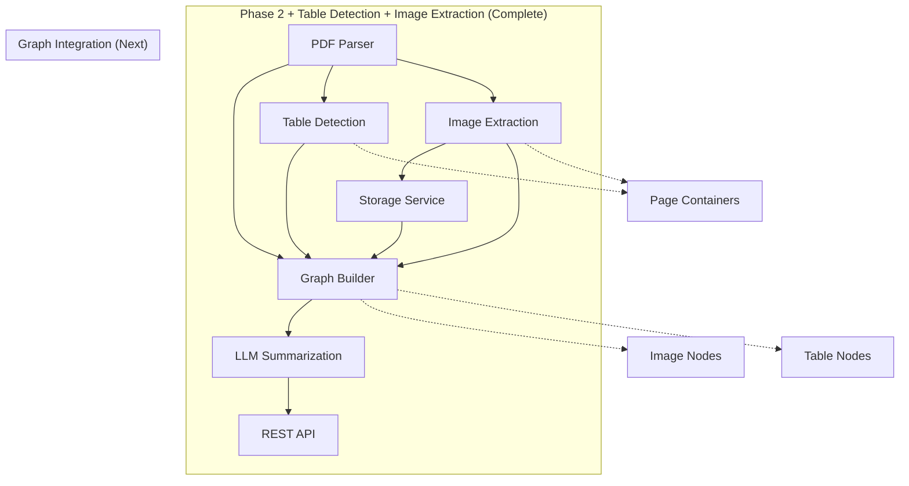

# PDF Summary AI - Phase 3 Image Extraction Complete Continuation Prompt

**Continuing from Phase 3 Image Extraction Complete (TASK-057 to TASK-059) → Phase 3 Graph Integration (TASK-060 onwards)**

---

## 🎯 Current Status

**Phase 1: Foundation - COMPLETED ✅**
- ✅ All 18 foundation tasks complete
- ✅ Express server running on port 4000
- ✅ PostgreSQL + Redis operational
- ✅ File upload system functional
- ✅ Jest testing framework ready
- ✅ Health checks passing (13/13 tests)

**Phase 2: Core Features - COMPLETED ✅**
- ✅ All 32 core feature tasks complete
- ✅ PDF parsing with text extraction and metadata
- ✅ Graph data structures (Node/Edge/Graph) implemented
- ✅ Graph builder with hierarchical and sequential relationships
- ✅ OpenAI integration with client wrapper and prompt templates
- ✅ Graph-aware summarization service with 6 summary types
- ✅ Token counting and cost estimation with analytics
- ✅ Complete REST API (upload, list, get, delete, summarize)
- ✅ Document management with CRUD operations and status tracking
- ✅ Comprehensive Zod validation schemas
- ✅ End-to-end PDF upload → graph → summary pipeline

**Phase 3: Advanced Features - TABLE DETECTION COMPLETE ✅**
- ✅ **Table Detection (6/6 tasks)**: TASK-051 to TASK-056 complete
- ✅ Table detection library research and selection (@krakz999/tabula-node primary)
- ✅ Dependencies installed (tabula-node + pdf-table-extractor)
- ✅ Table extraction service with primary/fallback logic
- ✅ Structured table data parsing (headers, rows, rawText)
- ✅ Table nodes in knowledge graph with metadata
- ✅ Comprehensive unit and integration tests

**Phase 3: Advanced Features - IMAGE EXTRACTION COMPLETE ✅**
- ✅ **Image Extraction (3/5 tasks)**: TASK-057 to TASK-059 complete
- ✅ PDF image extraction libraries installed (pdf2pic, sharp, canvas, pdf-lib)
- ✅ Image extraction service with page-to-image conversion
- ✅ Configurable DPI, quality, and format settings (PNG/JPEG/TIFF)
- ✅ Storage service with extensible backend architecture
- ✅ Local storage with organized directory structure
- ✅ Image metadata extraction and validation
- ✅ Comprehensive unit tests for both services

**Phase 3: Advanced Features - REMAINING WORK 🚀**
- **Graph Integration**: TASK-060 to TASK-061 (2 tasks) - **NEXT PRIORITY**
- **Reference Detection**: TASK-062 to TASK-068 (7 tasks)
- **Semantic Processing**: TASK-069 to TASK-074 (6 tasks)
- **MCP Context Retrieval**: TASK-075 to TASK-080 (6 tasks)
- **Grounding System**: TASK-081 to TASK-085 (5 tasks)
- **Evaluation System**: TASK-086 to TASK-092 (7 tasks)
- **Observability**: TASK-093 to TASK-095 (3 tasks)
- **Total Remaining**: 36 advanced feature tasks

---

## 📋 Phase 3 Remaining Task Overview

### 3.2 Image Extraction (2/5 tasks remaining)
- ✅ TASK-057: Install image extraction libraries
- ✅ TASK-058: Extract images from PDF pages
- ✅ TASK-059: Save images to storage
- ⏭️ **TASK-060: Create image nodes in graph** - Integrate images into knowledge graph
- ⏭️ **TASK-061: Add image extraction tests** - Write unit and integration tests

### 3.3 Reference Detection (7 tasks: TASK-062 to TASK-068)
- TASK-062: Define reference patterns (regex)
- TASK-063: Implement reference text detection
- TASK-064: Match references to target nodes
- TASK-065: Create reference edges in graph
- TASK-066: Add reference validation
- TASK-067: Test reference detection accuracy
- TASK-068: Add reference detection tests

### 3.4 Semantic Processing (6 tasks: TASK-069 to TASK-074)
- TASK-069: Implement semantic chunking
- TASK-070: Integrate OpenAI embeddings API
- TASK-071: Generate embeddings for text nodes
- TASK-072: Implement cosine similarity calculation
- TASK-073: Create semantic edges in graph
- TASK-074: Add embeddings caching (Redis)

### 3.5 MCP Context Retrieval (6 tasks: TASK-075 to TASK-080)
- TASK-075: Define MCP tool schemas
- TASK-076: Implement get_related_node tool
- TASK-077: Implement neighborhood traversal (BFS)
- TASK-078: Add token budget management
- TASK-079: Create context formatting
- TASK-080: Test MCP retrieval with OpenAI

### 3.6 Grounding System (5 tasks: TASK-081 to TASK-085)
- TASK-081: Parse LLM outputs for statements
- TASK-082: Extract grounding references from metadata
- TASK-083: Link statements to source nodes
- TASK-084: Calculate grounding reliability scores
- TASK-085: Format grounded summary output

### 3.7 Evaluation System (7 tasks: TASK-086 to TASK-092)
- TASK-086: Set up Python RAGAS service
- TASK-087: Implement RAGAS client (Node.js)
- TASK-088: Calculate faithfulness score
- TASK-089: Calculate answer relevancy score
- TASK-090: Implement custom grounding metric
- TASK-091: Implement custom coverage metric
- TASK-092: Calculate overall evaluation score

### 3.8 Observability (3 tasks: TASK-093 to TASK-095)
- TASK-093: Set up Prometheus metrics
- TASK-094: Implement OpenTelemetry tracing
- TASK-095: Configure Grafana dashboards

---

## 🎯 Phase 3 Continuation Instructions

**Prerequisites (Already Completed from Phase 1, 2, Table Detection & Image Extraction)**

✅ Node.js project with TypeScript
✅ Docker containers running (PostgreSQL + Redis)
✅ Database schema and migrations
✅ Client wrappers for database and Redis
✅ Express server with middleware (CORS, compression, security)
✅ File upload system with Multer and validation
✅ Jest testing framework with TypeScript

✅ **PDF Parser Service** - Complete PDF parsing with text extraction, metadata, paragraph detection
✅ **Graph Data Structures** - Node/Edge/Graph interfaces, Graph class with adjacency list
✅ **Graph Builder** - Converts PDF to knowledge graph with hierarchical and sequential relationships
✅ **OpenAI Integration** - Client wrapper, prompt templates, summarization service, token management
✅ **API Layer** - Complete REST API with document management, validation, and error handling

✅ **Table Detection Service** - Extract tables from PDFs with primary/fallback logic
✅ **Table Graph Integration** - Table nodes created in knowledge graph with metadata

✅ **Image Extraction Service** - NEW: Extract images from PDF pages with pdf2pic
✅ **Storage Service** - NEW: Extensible storage backend with local filesystem implementation
✅ **Image Processing** - NEW: Image metadata extraction and organized storage

**Current Project Structure**
```
pdf-summarize/
├── docker-compose.yml          # PostgreSQL + Redis services ✅
├── src/
│   ├── config/environment.ts   # Environment configuration ✅
│   ├── database/               # PostgreSQL + Redis clients ✅
│   ├── api/
│   │   ├── controllers/
│   │   │   └── document.controller.ts  # API endpoints ✅
│   │   ├── middleware/
│   │   │   └── upload.ts       # File upload middleware ✅
│   │   ├── routes/
│   │   │   └── documents.ts    # Document routes ✅
│   │   └── schemas.ts          # Zod validation schemas ✅
│   ├── models/
│   │   ├── graph.model.ts      # Graph data structures ✅
│   │   └── index.ts            # TypeScript interfaces ✅
│   ├── services/
│   │   ├── pdf-parser.service.ts        # PDF processing ✅
│   │   ├── graph/                       # Graph services ✅
│   │   │   ├── graph.ts                 # Graph class implementation
│   │   │   ├── graph-factory.ts         # Node/Edge factories
│   │   │   ├── graph-builder.ts         # PDF to graph conversion
│   │   │   └── index.ts                 # Exports
│   │   ├── llm/                         # LLM services ✅
│   │   │   ├── OpenAIProvider.ts        # OpenAI integration
│   │   │   ├── GoogleProvider.ts        # Google AI integration
│   │   │   ├── LLMProviderManager.ts    # Provider management
│   │   │   ├── prompt-templates.ts      # Prompt templates
│   │   │   ├── summarization.service.ts # Summarization service
│   │   │   ├── token-manager.ts         # Token & cost management
│   │   │   └── index.ts                 # Exports
│   │   ├── table-detection.service.ts   # Table extraction ✅
│   │   ├── image-extraction.service.ts  # NEW: Image extraction ✅
│   │   ├── storage.service.ts           # NEW: Storage abstraction ✅
│   │   ├── document.service.ts          # Document CRUD ✅
│   │   └── [PHASE 3] New services will be added here
│   ├── utils/                  # Logger, errors ✅
│   └── server.ts               # Express server ✅
├── tests/
│   ├── unit/                   # Unit tests ✅
│   │   ├── table-detection.service.test.ts  # Table tests ✅
│   │   ├── image-extraction.service.test.ts # NEW: Image tests ✅
│   │   ├── storage.service.test.ts          # NEW: Storage tests ✅
│   ├── fixtures/               # Mock data ✅
│   └── utils/                  # Test helpers ✅
└── package.json                # Dependencies ✅
```

---

## 🚀 Continuation Strategy

**Start with TASK-060: Create image nodes in graph**

Follow sequential order within each task group:
1. **Graph Integration (2 tasks)**: TASK-060 → TASK-061
2. **Reference Detection (7 tasks)**: TASK-062 → TASK-068
3. **Semantic Processing (6 tasks)**: TASK-069 → TASK-074
4. **MCP Context Retrieval (6 tasks)**: TASK-075 → TASK-080
5. **Grounding System (5 tasks)**: TASK-081 → TASK-085
6. **Evaluation System (7 tasks)**: TASK-086 → TASK-092
7. **Observability (3 tasks)**: TASK-093 → TASK-095

**Test incrementally**: Run tests after each task completion

**Use existing patterns**: Follow established code structure from Phase 1 & 2 & Table Detection & Image Extraction

**Maintain type safety**: Continue using TypeScript interfaces

**Extend existing services**: Build upon the graph builder, table detection, image extraction, and document management systems

**Leverage image extraction patterns**: Use similar service architecture for reference detection and semantic processing

---

## 📚 Key Documentation References

**Required Reading for Graph Integration:**

- [`docs/implementation/TASK-SPECIFICATIONS.md`](./docs/implementation/TASK-SPECIFICATIONS.md) - Detailed task specs (Phase 3 tasks)
- [`docs/architecture/C4-ARCHITECTURE.md`](./docs/architecture/C4-ARCHITECTURE.md) - System design
- [`docs/llm/MULTI-LLM-QUICKSTART.md`](./docs/llm/MULTI-LLM-QUICKSTART.md) - LLM integration
- [`src/services/llm/README.md`](./src/services/llm/README.md) - LLM service patterns
- [`src/services/table-detection.service.ts`](./src/services/table-detection.service.ts) - Table detection patterns
- [`src/services/image-extraction.service.ts`](./src/services/image-extraction.service.ts) - NEW: Image extraction patterns
- [`src/services/storage.service.ts`](./src/services/storage.service.ts) - NEW: Storage service patterns

**Integration Points:**
- Graph: Extend `GraphBuilder` from `src/services/graph/` (table integration already added)
- LLM: Use `llmProviderManager` from `src/services/llm/`
- Document: Use `documentService` from `src/services/document.service.ts`
- Image Extraction: Use `imageExtractionService` from `src/services/image-extraction.service.ts`
- Storage: Use `storageService` from `src/services/storage.service.ts`
- Models: Extend interfaces in `src/models/graph.model.ts`
- Environment: Use `config` from `src/config/environment.ts`

---

## 🎯 Phase 3 Success Criteria (Graph Integration)

**After completing TASK-060 & TASK-061:**

✅ **Image Graph Integration:**
- Images extracted from PDF pages with metadata
- Images stored locally with organized structure
- Image nodes created in knowledge graph with metadata
- Image processing integrated with existing graph building
- Image nodes connected to page containers with "contains" edges
- Image metadata includes dimensions, format, file path, MIME type
- Graph structure remains valid with image nodes

✅ **Testing & Quality:**
- All new code tested (unit + integration)
- Test coverage maintained >80%
- ESLint + Prettier passing
- TypeScript compilation successful
- Image extraction pipeline fully functional

---

## 🔗 Integration Points Summary

**Graph Extensions:**
```typescript
import { GraphBuilder } from '../services/graph';
// Extend GraphBuilder to add image nodes (similar to table integration)
const graph = await GraphBuilder.buildGraph(documentId, pdfResult, tables, images);
```

**Image Service Extensions:**
```typescript
import { imageExtractionService } from '../services/image-extraction';
import { storageService } from '../services/storage';
// Extract and store images
const images = await imageExtractionService.extractImages(pdfPath, outputDir);
```

**New Services to Create:**
- Extend `GraphBuilder` to accept `ExtractedImage[]` parameter
- Extend `GraphFactory` to create image nodes
- Add image processing to document workflow

---

## 🏃‍♂️ Next Steps Execution

**TASK-060: Create image nodes in graph**
1. Extend `GraphBuilder.buildGraph()` to accept optional `ExtractedImage[]` parameter
2. Create `createImageNode()` method in GraphFactory
3. Implement `processImagesOnPage()` in GraphBuilder
4. Add image node connections to page containers
5. Store image metadata in node properties
6. Update graph building pipeline to include images
7. Add image processing to document workflow
8. Ensure backward compatibility

**Continue through remaining Phase 3 systematically...**

---

## 📊 Progress Tracking

**Phase 3 Progress**: 11/45 tasks complete (24%)
**Overall Progress**: 59/95 tasks complete (62%)

**Phase 3 Milestones:**
- ✅ Table detection working (6/45)
- ✅ Image extraction working (11/45) - **CURRENT STATUS**
- [ ] Graph integration complete (13/45)
- [ ] Reference detection functional (20/45)
- [ ] Semantic processing implemented (26/45)
- [ ] MCP context retrieval working (32/45)
- [ ] Grounding system operational (37/45)
- [ ] Evaluation system running (44/45)
- [ ] Observability dashboards live (45/45)

---

## 🔧 Key Technical Considerations (Graph Integration)

### **Image Node Integration Challenges**
- Image metadata structure and storage in graph nodes
- Connecting images to correct page containers
- Handling multiple images per page
- Image node IDs and naming consistency
- Graph traversal with image nodes
- Memory usage for large images in graph
- Backward compatibility with existing graph operations

### **Storage Integration Challenges**
- Coordinating image extraction with storage operations
- Handling storage failures gracefully
- File path management in graph metadata
- Storage backend extensibility (local → cloud)
- Image file organization and retrieval

### **Performance Considerations**
- Image processing time impact on document processing
- Graph size growth with image nodes
- Memory usage for image metadata
- Storage I/O performance

---

## 🎯 Phase 3 Architecture Extensions (Graph Integration)

The graph integration extends the current system:



---

## 💡 Implementation Priorities

### **High Priority (Complete Image Pipeline)**
- Image nodes in knowledge graph with metadata
- Image connections to page containers
- Storage integration with graph
- Backward compatibility maintained
- Comprehensive testing

### **Medium Priority (Future Extensions)**
- Cloud storage backend implementation
- Image OCR integration
- Advanced image processing
- Performance optimizations

### **Low Priority (Advanced Features)**
- Image similarity detection
- Image clustering in graph
- Visual content analysis

---

## 🚀 Ready to continue Phase 3 graph integration implementation!

**Start with TASK-060 and proceed systematically through graph integration, then continue with reference detection, semantic processing, MCP integration, grounding, evaluation, and observability.**

**The image extraction foundation is complete - now integrating images into the knowledge graph! 🚀**

---

**Last Updated**: 2025-11-27
**Phase 3 Tasks**: 36 remaining (TASK-060 to TASK-095)
**Estimated Duration**: 10-14 days
**Ready for**: Graph integration and advanced features

---
